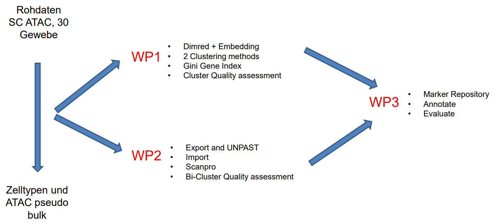

# biodaten23-24-scATAC-clustering

## Allgemeine Aufgabenstellung
  

    Investigate and evaluate  
    the effect of pattern finding and clustering  
    in the context of chromatin accessibility  
    at single cell resolution,  
    and  
    the annotation of clusters
  

  Good cooperation within the groups, but also between the groups, is important.

  
  Since only a limited number of students applied for this course, WP2 is cancelled and WP3 is now WP2

## Arbeitsgruppen
This project focuses on analysing scATAC-Seq data using clustering algorithms and developing the Residual Average Gini Index (RAGI) metric. The aim is to explore patterns in chromatin accessibility at the single-cell level and to determine clusters of different cell types, that can then be annotated. The cell annotation is made possible by using marker gene lists, which are stored in the Marker Repository. This project also aimed to automate the annotation process as much as possible and to evaluate the quality of the annotations using an ontology label as a reference.

### [WP1](wp1/)
- preprocessing
- dimension reduction
- clustering
- export for WP2

### [WP2](wp2/)
- create a marker list
- transfer markers from a source organism using the homology function
- annotate the cluster based on the marker list used as input
- automate the annotation process
- evaluate the quality of the annotation
