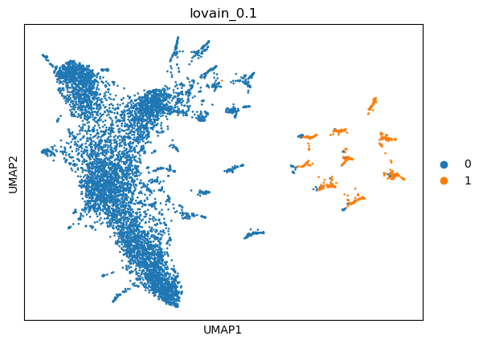

|   kmeans_13 | mr_two_column     |
|------------:|:------------------|
|           0 | nan               |
|           1 | Mast cells        |
|           2 | nan               |
|           3 | nan               |
|           4 | Neurons           |
|           5 | Interneurons      |
|           6 | Mast cells        |
|           7 | Chondrocytes      |
|           8 | nan               |
|           9 | Endothelial cells |
|          10 | Mast cells        |
|          11 | Mast cells        |
|          12 | Mast cells        |
---

|   kmeans_16 | mr_two_column     |
|------------:|:------------------|
|           0 | Interneurons      |
|           1 | nan               |
|           2 | Mast cells        |
|           3 | nan               |
|           4 | Mast cells        |
|           5 | Müller cells      |
|           6 | Endothelial cells |
|           7 | Mast cells        |
|           8 | nan               |
|           9 | Chondrocytes      |
|          10 | Mast cells        |
|          11 | Endothelial cells |
|          12 | Mast cells        |
|          13 | nan               |
|          14 | Neurons           |
|          15 | nan               |
---

|   leiden_0.1 | mr_two_column          |
|-------------:|:-----------------------|
|            0 | Retinal ganglion cells |
|            1 | Mast cells             |
|            2 | nan                    |
---

|   leiden_0.25 | mr_two_column          |
|--------------:|:-----------------------|
|             0 | Interneurons           |
|             1 | Neurons                |
|             2 | Chondrocytes           |
|             3 | Endothelial cells      |
|             4 | Mast cells             |
|             5 | Endothelial cells      |
|             6 | Mast cells             |
|             7 | Retinal ganglion cells |
|             8 | nan                    |
---

|   leiden_0.5 | mr_two_column          |
|-------------:|:-----------------------|
|            0 | Interneurons           |
|            1 | Neurons                |
|            2 | Chondrocytes           |
|            3 | Endothelial cells      |
|            4 | Mast cells             |
|            5 | Endothelial cells      |
|            6 | Mast cells             |
|            7 | Mast cells             |
|            8 | Endothelial cells      |
|            9 | Mast cells             |
|           10 | nan                    |
|           11 | Endothelial cells      |
|           12 | nan                    |
|           13 | Müller cells           |
|           14 | nan                    |
|           15 | Retinal ganglion cells |
|           16 | nan                    |
---

|   leiden_1 | mr_two_column          |
|-----------:|:-----------------------|
|          0 | Neurons                |
|          1 | Retinal ganglion cells |
|          2 | Endothelial cells      |
|          3 | Chondrocytes           |
|          4 | Epithelial cells       |
|          5 | Müller cells           |
|          6 | Mast cells             |
|          7 | nan                    |
|          8 | Interneurons           |
|          9 | Mast cells             |
|         10 | Endothelial cells      |
|         11 | Mast cells             |
|         12 | Endothelial cells      |
|         13 | Mast cells             |
|         14 | Endothelial cells      |
|         15 | nan                    |
|         16 | Retinal ganglion cells |
|         17 | nan                    |
|         18 | Endothelial cells      |
|         19 | Müller cells           |
|         20 | nan                    |
|         21 | Endothelial cells      |
|         22 | nan                    |
|         23 | Endothelial cells      |
|         24 | nan                    |
|         25 | nan                    |
|         26 | nan                    |
|         27 | nan                    |
---

|   lovain_0.1 | mr_two_column   |
|-------------:|:----------------|
|            0 | Chondrocytes    |
|            1 | Mast cells      |
---

|   lovain_0.25 | mr_two_column     |
|--------------:|:------------------|
|             0 | Neurons           |
|             1 | Chondrocytes      |
|             2 | Endothelial cells |
|             3 | Mast cells        |
|             4 | Endothelial cells |
---

|   lovain_0.5 | mr_two_column     |
|-------------:|:------------------|
|            0 | Neurons           |
|            1 | nan               |
|            2 | Chondrocytes      |
|            3 | Endothelial cells |
|            4 | Mast cells        |
|            5 | Mast cells        |
|            6 | nan               |
|            7 | Müller cells      |
|            8 | Mast cells        |
|            9 | nan               |
|           10 | nan               |
---

|   lovain_1 | mr_two_column          |
|-----------:|:-----------------------|
|          0 | Neurons                |
|          1 | Retinal ganglion cells |
|          2 | Endothelial cells      |
|          3 | Chondrocytes           |
|          4 | Epithelial cells       |
|          5 | nan                    |
|          6 | Mast cells             |
|          7 | Müller cells           |
|          8 | nan                    |
|          9 | Mast cells             |
|         10 | Mast cells             |
|         11 | Mast cells             |
|         12 | nan                    |
|         13 | Interneurons           |
|         14 | Retinal ganglion cells |
|         15 | Endothelial cells      |
|         16 | nan                    |
|         17 | Endothelial cells      |
|         18 | Retinal ganglion cells |
|         19 | nan                    |
|         20 | Epithelial cells       |
---
