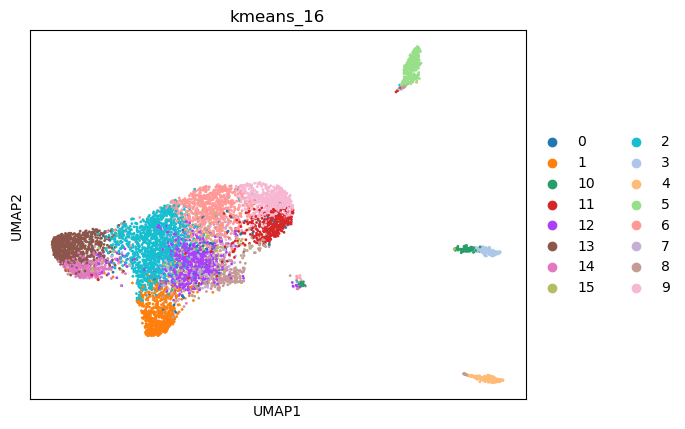

|   kmeans_13 | mr_two_column     |
|------------:|:------------------|
|           0 | Enterocytes       |
|           1 | Mast cells        |
|          10 | Macrophages       |
|          11 | Interneurons      |
|          12 | Enterocytes       |
|           2 | Interneurons      |
|           3 | Macrophages       |
|           4 | Endothelial cells |
|           5 | Fibroblasts       |
|           6 | Neurons           |
|           7 | Enterocytes       |
|           8 | Enterocytes       |
|           9 | Neurons           |
---

|   kmeans_16 | mr_two_column              |
|------------:|:---------------------------|
|           0 | Olfactory epithelial cells |
|           1 | Mast cells                 |
|          10 | Macrophages                |
|          11 | Interneurons               |
|          12 | Enterocytes                |
|          13 | Neurons                    |
|          14 | Enterocytes                |
|          15 | Enterocytes                |
|           2 | Interneurons               |
|           3 | Macrophages                |
|           4 | Endothelial cells          |
|           5 | Fibroblasts                |
|           6 | Neurons                    |
|           7 | Enterocytes                |
|           8 | Enteric neurons            |
|           9 | Neurons                    |
---

|   leiden_0.1 | mr_two_column     |
|-------------:|:------------------|
|            0 | Neurons           |
|            1 | Fibroblasts       |
|            2 | Macrophages       |
|            3 | Endothelial cells |
---

|   leiden_0.25 | mr_two_column     |
|--------------:|:------------------|
|             0 | Interneurons      |
|             1 | Neurons           |
|             2 | Enterocytes       |
|             3 | Epithelial cells  |
|             4 | Fibroblasts       |
|             5 | Macrophages       |
|             6 | Endothelial cells |
---

|   leiden_0.5 | mr_two_column     |
|-------------:|:------------------|
|            0 | Enterocytes       |
|            1 | Neurons           |
|            2 | Enterocytes       |
|            3 | Neurons           |
|            4 | Epithelial cells  |
|            5 | Fibroblasts       |
|            6 | Macrophages       |
|            7 | Endothelial cells |
---

|   leiden_1 | mr_two_column     |
|-----------:|:------------------|
|          0 | Enterocytes       |
|          1 | Interneurons      |
|          2 | Enterocytes       |
|          3 | Neurons           |
|          4 | Neurons           |
|          5 | Mast cells        |
|          6 | Fibroblasts       |
|          7 | Macrophages       |
|          8 | Endothelial cells |
---

|   lovain_0.1 | mr_two_column     |
|-------------:|:------------------|
|            0 | Neurons           |
|            1 | Fibroblasts       |
|            2 | Macrophages       |
|            3 | Endothelial cells |
---

|   lovain_0.25 | mr_two_column     |
|--------------:|:------------------|
|             0 | Interneurons      |
|             1 | Interneurons      |
|             2 | Enterocytes       |
|             3 | Fibroblasts       |
|             4 | Macrophages       |
|             5 | Endothelial cells |
---

|   lovain_0.5 | mr_two_column     |
|-------------:|:------------------|
|            0 | Interneurons      |
|            1 | Neurons           |
|            2 | Enterocytes       |
|            3 | Mast cells        |
|            4 | Fibroblasts       |
|            5 | Macrophages       |
|            6 | Endothelial cells |
---

|   lovain_1 | mr_two_column     |
|-----------:|:------------------|
|          0 | Interneurons      |
|          1 | Enterocytes       |
|          2 | Enterocytes       |
|          3 | Neurons           |
|          4 | Interneurons      |
|          5 | Mast cells        |
|          6 | Fibroblasts       |
|          7 | Macrophages       |
|          8 | Endothelial cells |
---
