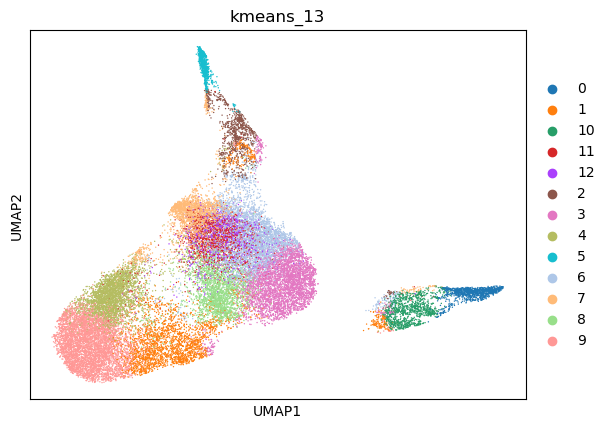
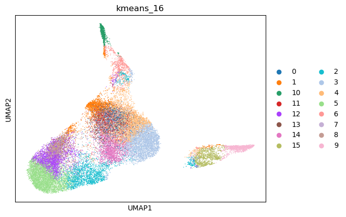
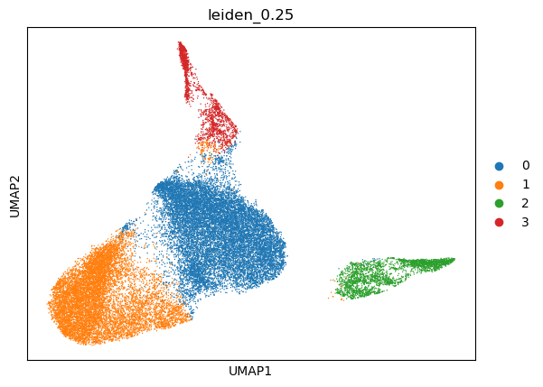
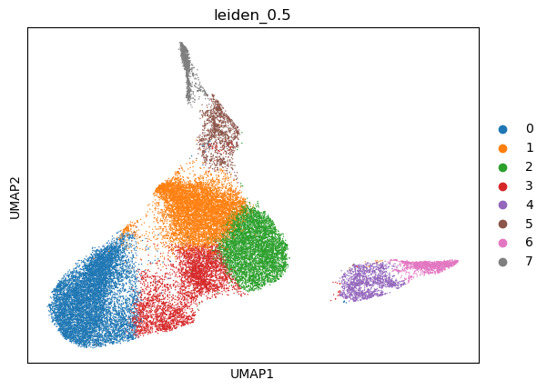
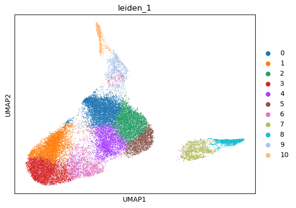
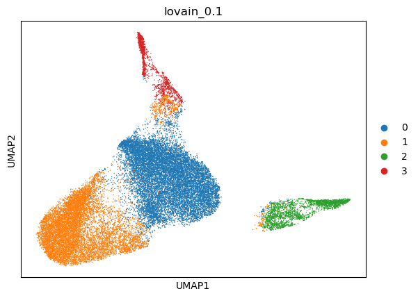
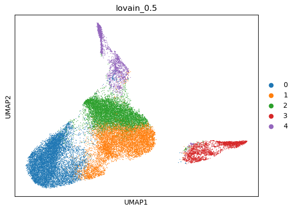
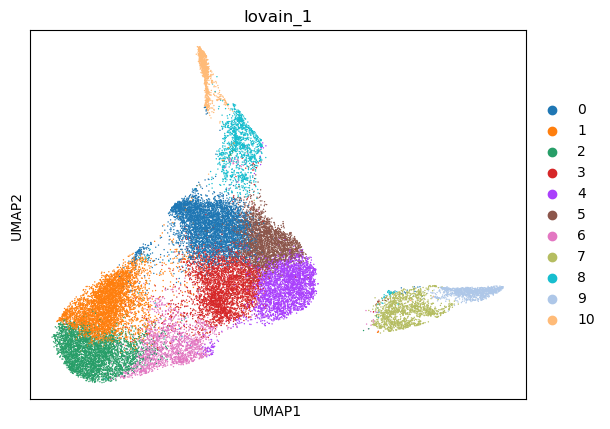

|   kmeans_13 | mr_two_column       |
|------------:|:--------------------|
|           0 | Interneurons        |
|           1 | Hepatocytes         |
|          10 | Interneurons        |
|          11 | Gastric chief cells |
|          12 | Epithelial cells    |
|           2 | Endothelial cells   |
|           3 | Neurons             |
|           4 | Leydig cells        |
|           5 | Endothelial cells   |
|           6 | Fibroblasts         |
|           7 | T helper cells      |
|           8 | Sertoli cells       |
|           9 | Hepatocytes         |
---

|   kmeans_16 | mr_two_column                                |
|------------:|:---------------------------------------------|
|           0 | Loop of Henle cells                          |
|           1 | T helper cells                               |
|          10 | Endothelial cells                            |
|          11 | Erythroid-like and erythroid precursor cells |
|          12 | Hepatocytes                                  |
|          13 | Leydig cells                                 |
|          14 | Smooth muscle cells                          |
|          15 | Interneurons                                 |
|           2 | Hepatocytes                                  |
|           3 | Neurons                                      |
|           4 | Fibroblasts                                  |
|           5 | Hepatocytes                                  |
|           6 | Endothelial cells                            |
|           7 | Hepatocytes                                  |
|           8 | Hepatocytes                                  |
|           9 | Interneurons                                 |
---

|   leiden_0.1 | mr_two_column     |
|-------------:|:------------------|
|            0 | Neurons           |
|            1 | Hepatocytes       |
|            2 | Interneurons      |
|            3 | Endothelial cells |
---

|   leiden_0.25 | mr_two_column     |
|--------------:|:------------------|
|             0 | Neurons           |
|             1 | Hepatocytes       |
|             2 | Interneurons      |
|             3 | Endothelial cells |
---

|   leiden_0.5 | mr_two_column     |
|-------------:|:------------------|
|            0 | Hepatocytes       |
|            1 | Crypt cells       |
|            2 | Neurons           |
|            3 | Enterocytes       |
|            4 | Interneurons      |
|            5 | Endothelial cells |
|            6 | Interneurons      |
|            7 | Endothelial cells |
---

|   leiden_1 | mr_two_column     |
|-----------:|:------------------|
|          0 | Radial glia cells |
|          1 | Hepatocytes       |
|          2 | Neurons           |
|          3 | Hepatocytes       |
|          4 | Dendritic cells   |
|          5 | Neurons           |
|          6 | Enterocytes       |
|          7 | Interneurons      |
|          8 | Interneurons      |
|          9 | Endothelial cells |
|         10 | Endothelial cells |
---

|   lovain_0.1 | mr_two_column     |
|-------------:|:------------------|
|            0 | Fibroblasts       |
|            1 | Hepatocytes       |
|            2 | Interneurons      |
|            3 | Endothelial cells |
---

|   lovain_0.25 | mr_two_column     |
|--------------:|:------------------|
|             0 | Neurons           |
|             1 | Hepatocytes       |
|             2 | Interneurons      |
|             3 | Endothelial cells |
---

|   lovain_0.5 | mr_two_column     |
|-------------:|:------------------|
|            0 | Hepatocytes       |
|            1 | Neurons           |
|            2 | Crypt cells       |
|            3 | Interneurons      |
|            4 | Endothelial cells |
---

|   lovain_1 | mr_two_column       |
|-----------:|:--------------------|
|          0 | Crypt cells         |
|          1 | Hepatocytes         |
|          2 | Hepatocytes         |
|          3 | Smooth muscle cells |
|          4 | Neurons             |
|          5 | Neurons             |
|          6 | Hepatocytes         |
|          7 | Interneurons        |
|          8 | Endothelial cells   |
|          9 | Interneurons        |
|         10 | Endothelial cells   |
---
