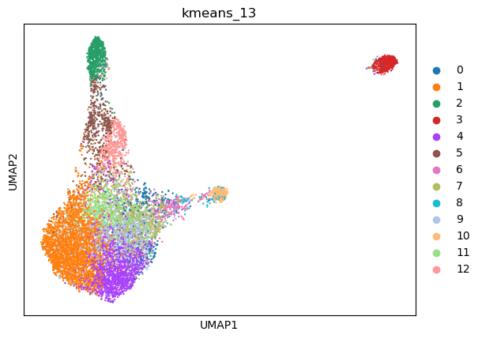
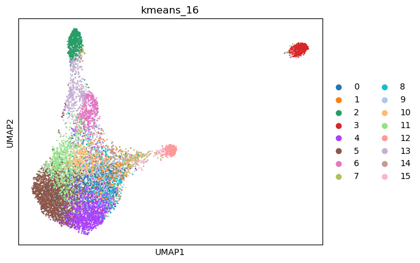
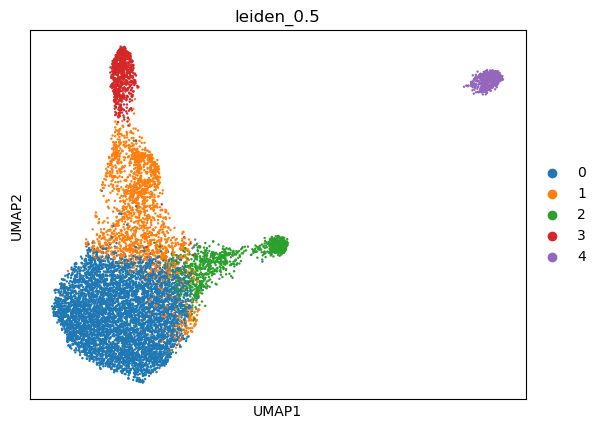
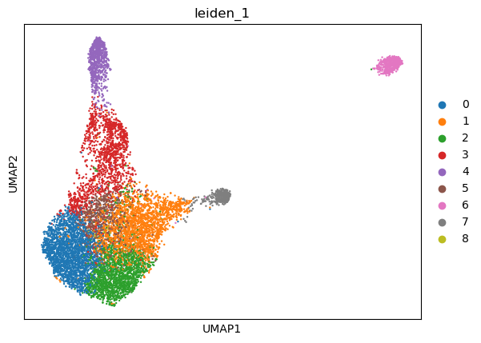
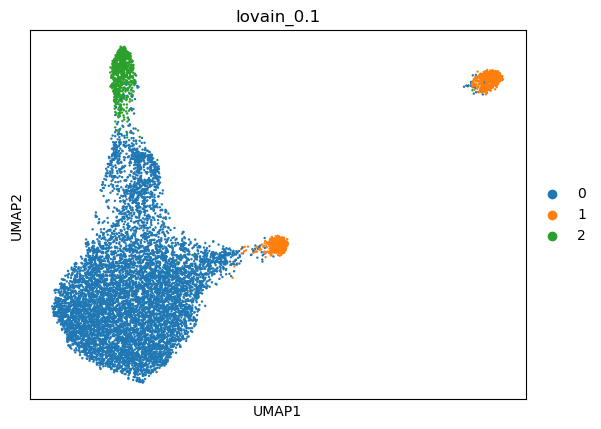
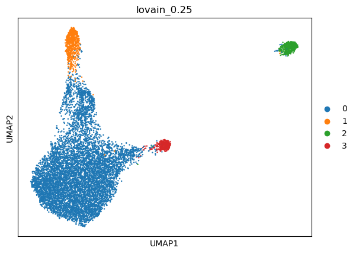
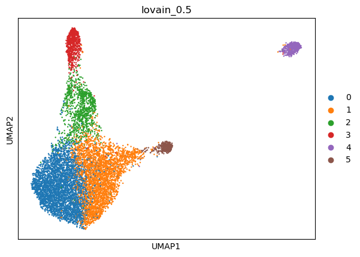
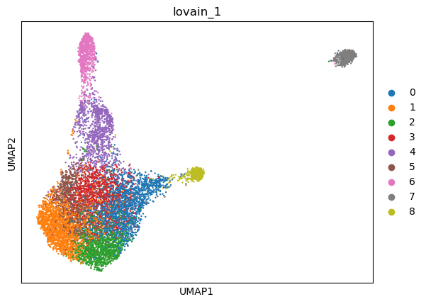

|   kmeans_13 | mr_two_column       |
|------------:|:--------------------|
|           0 | Fibroblasts         |
|           1 | Smooth muscle cells |
|           2 | Fibroblasts         |
|           3 | Endothelial cells   |
|           4 | Smooth muscle cells |
|           5 | Fibroblasts         |
|           6 | Microfold cells     |
|           7 | Crypt cells         |
|           8 | Mast cells          |
|           9 | Myofibroblasts      |
|          10 | Macrophages         |
|          11 | Smooth muscle cells |
|          12 | Fibroblasts         |
---

|   kmeans_16 | mr_two_column                |
|------------:|:-----------------------------|
|           0 | Myofibroblasts               |
|           1 | Pancreatic stellate cells    |
|           2 | Fibroblasts                  |
|           3 | Endothelial cells            |
|           4 | Smooth muscle cells          |
|           5 | Smooth muscle cells          |
|           6 | Fibroblasts                  |
|           7 | Plasmacytoid dendritic cells |
|           8 | Smooth muscle cells          |
|           9 | Retinal ganglion cells       |
|          10 | Cajal-Retzius cells          |
|          11 | Fibroblasts                  |
|          12 | Macrophages                  |
|          13 | Fibroblasts                  |
|          14 | Natural killer T cells       |
|          15 | Microfold cells              |
---

|   leiden_0.1 | mr_two_column       |
|-------------:|:--------------------|
|            0 | Smooth muscle cells |
|            1 | Platelets           |
|            2 | Fibroblasts         |
---

|   leiden_0.25 | mr_two_column       |
|--------------:|:--------------------|
|             0 | Smooth muscle cells |
|             1 | Fibroblasts         |
|             2 | Endothelial cells   |
|             3 | Macrophages         |
---

|   leiden_0.5 | mr_two_column       |
|-------------:|:--------------------|
|            0 | Smooth muscle cells |
|            1 | Fibroblasts         |
|            2 | Macrophages         |
|            3 | Fibroblasts         |
|            4 | Endothelial cells   |
---

|   leiden_1 | mr_two_column             |
|-----------:|:--------------------------|
|          0 | Smooth muscle cells       |
|          1 | Crypt cells               |
|          2 | Smooth muscle cells       |
|          3 | Fibroblasts               |
|          4 | Fibroblasts               |
|          5 | Fibroblasts               |
|          6 | Endothelial cells         |
|          7 | Macrophages               |
|          8 | Endothelial cells (aorta) |
---

|   lovain_0.1 | mr_two_column       |
|-------------:|:--------------------|
|            0 | Smooth muscle cells |
|            1 | Platelets           |
|            2 | Fibroblasts         |
---

|   lovain_0.25 | mr_two_column       |
|--------------:|:--------------------|
|             0 | Smooth muscle cells |
|             1 | Fibroblasts         |
|             2 | Endothelial cells   |
|             3 | Macrophages         |
---

|   lovain_0.5 | mr_two_column       |
|-------------:|:--------------------|
|            0 | Smooth muscle cells |
|            1 | Myofibroblasts      |
|            2 | Fibroblasts         |
|            3 | Fibroblasts         |
|            4 | Endothelial cells   |
|            5 | Macrophages         |
---

|   lovain_1 | mr_two_column              |
|-----------:|:---------------------------|
|          0 | Adipocyte progenitor cells |
|          1 | Smooth muscle cells        |
|          2 | Smooth muscle cells        |
|          3 | Fibroblasts                |
|          4 | Fibroblasts                |
|          5 | Smooth muscle cells        |
|          6 | Fibroblasts                |
|          7 | Endothelial cells          |
|          8 | Macrophages                |
---
