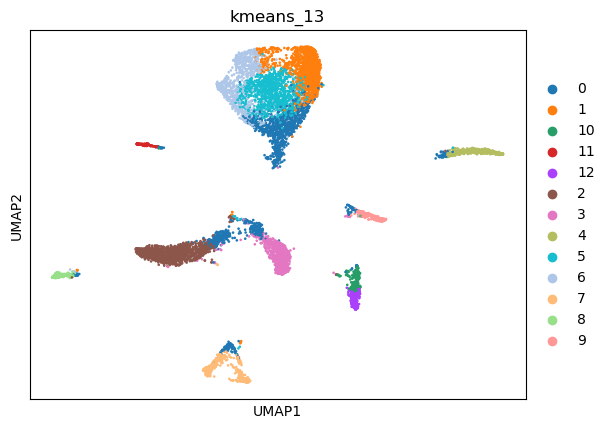
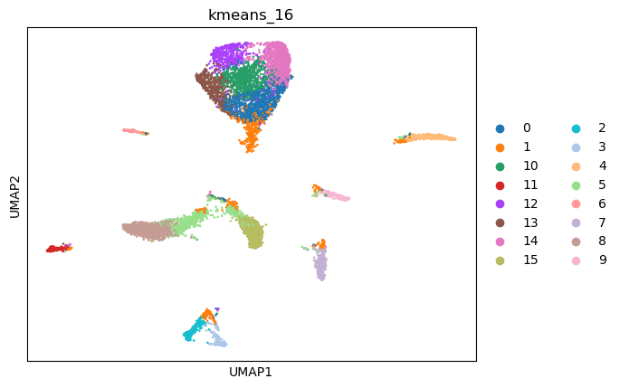
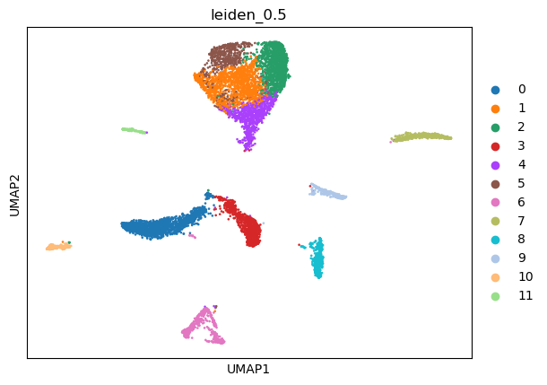
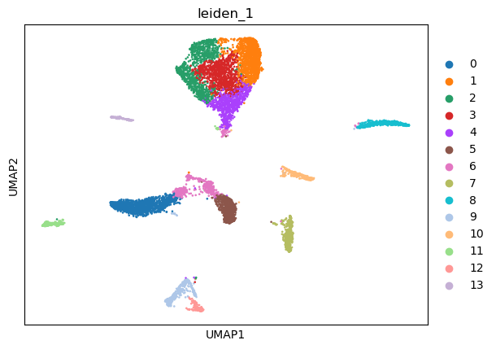
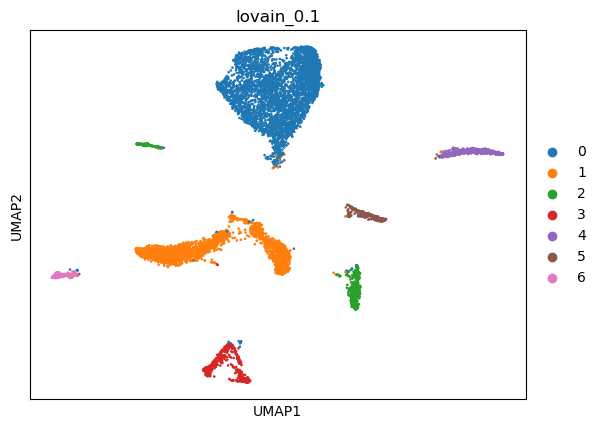
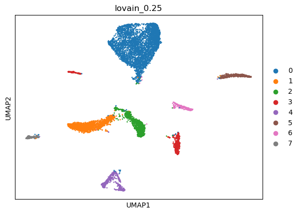
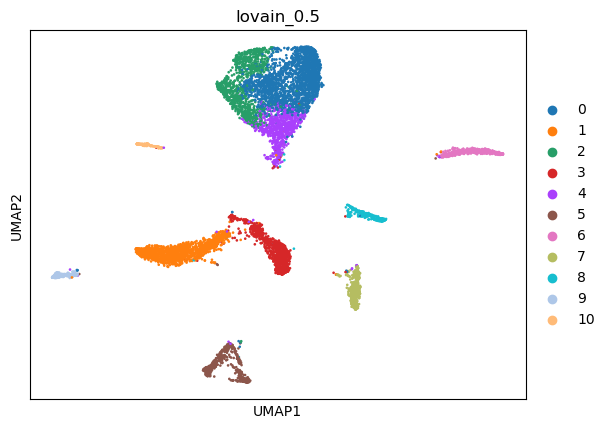
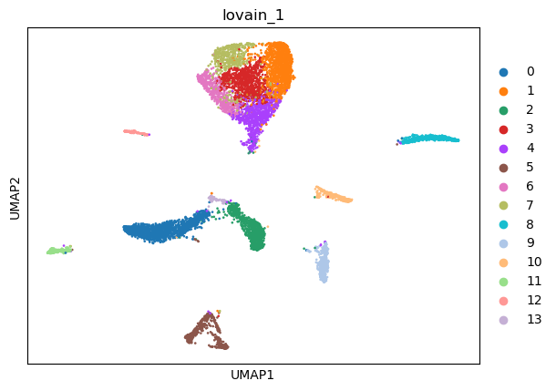

|   kmeans_13 | mr_two_column       |
|------------:|:--------------------|
|           0 | Enterocytes         |
|           1 | Fibroblasts         |
|          10 | Endothelial cells   |
|          11 | Endothelial cells   |
|          12 | Endothelial cells   |
|           2 | Cardiomyocytes      |
|           3 | Smooth muscle cells |
|           4 | Macrophages         |
|           5 | Fibroblasts         |
|           6 | Fibroblasts         |
|           7 | Schwann cells       |
|           8 | Pericytes           |
|           9 | Podocytes           |
---

|   kmeans_16 | mr_two_column       |
|------------:|:--------------------|
|           0 | Fibroblasts         |
|           1 | Enterocytes         |
|          10 | Fibroblasts         |
|          11 | Pericytes           |
|          12 | Fibroblasts         |
|          13 | Fibroblasts         |
|          14 | Fibroblasts         |
|          15 | Smooth muscle cells |
|           2 | Schwann cells       |
|           3 | Schwann cells       |
|           4 | Macrophages         |
|           5 | Cardiomyocytes      |
|           6 | Endothelial cells   |
|           7 | Endothelial cells   |
|           8 | Cardiomyocytes      |
|           9 | Podocytes           |
---

|   leiden_0.1 | mr_two_column       |
|-------------:|:--------------------|
|            0 | Fibroblasts         |
|            1 | Smooth muscle cells |
|            2 | Endothelial cells   |
|            3 | Schwann cells       |
|            4 | Macrophages         |
|            5 | Podocytes           |
|            6 | Pericytes           |
---

|   leiden_0.25 | mr_two_column       |
|--------------:|:--------------------|
|             0 | Fibroblasts         |
|             1 | Cardiomyocytes      |
|             2 | Smooth muscle cells |
|             3 | Schwann cells       |
|             4 | Macrophages         |
|             5 | Endothelial cells   |
|             6 | Podocytes           |
|             7 | Pericytes           |
|             8 | Endothelial cells   |
---

|   leiden_0.5 | mr_two_column       |
|-------------:|:--------------------|
|            0 | Cardiomyocytes      |
|            1 | Fibroblasts         |
|            2 | Fibroblasts         |
|            3 | Smooth muscle cells |
|            4 | Enterocytes         |
|            5 | Fibroblasts         |
|            6 | Schwann cells       |
|            7 | Macrophages         |
|            8 | Endothelial cells   |
|            9 | Podocytes           |
|           10 | Pericytes           |
|           11 | Endothelial cells   |
---

|   leiden_1 | mr_two_column       |
|-----------:|:--------------------|
|          0 | Cardiomyocytes      |
|          1 | Fibroblasts         |
|          2 | Fibroblasts         |
|          3 | Fibroblasts         |
|          4 | Enterocytes         |
|          5 | Smooth muscle cells |
|          6 | Cardiomyocytes      |
|          7 | Endothelial cells   |
|          8 | Macrophages         |
|          9 | Schwann cells       |
|         10 | Podocytes           |
|         11 | Pericytes           |
|         12 | Schwann cells       |
|         13 | Endothelial cells   |
---

|   lovain_0.1 | mr_two_column       |
|-------------:|:--------------------|
|            0 | Fibroblasts         |
|            1 | Smooth muscle cells |
|            2 | Endothelial cells   |
|            3 | Schwann cells       |
|            4 | Macrophages         |
|            5 | Podocytes           |
|            6 | Pericytes           |
---

|   lovain_0.25 | mr_two_column       |
|--------------:|:--------------------|
|             0 | Fibroblasts         |
|             1 | Cardiomyocytes      |
|             2 | Smooth muscle cells |
|             3 | Endothelial cells   |
|             4 | Schwann cells       |
|             5 | Macrophages         |
|             6 | Podocytes           |
|             7 | Pericytes           |
---

|   lovain_0.5 | mr_two_column       |
|-------------:|:--------------------|
|            0 | Fibroblasts         |
|            1 | Cardiomyocytes      |
|            2 | Fibroblasts         |
|            3 | Smooth muscle cells |
|            4 | Enterocytes         |
|            5 | Schwann cells       |
|            6 | Macrophages         |
|            7 | Endothelial cells   |
|            8 | Podocytes           |
|            9 | Pericytes           |
|           10 | Endothelial cells   |
---

|   lovain_1 | mr_two_column       |
|-----------:|:--------------------|
|          0 | Cardiomyocytes      |
|          1 | Fibroblasts         |
|          2 | Smooth muscle cells |
|          3 | Fibroblasts         |
|          4 | Enterocytes         |
|          5 | Schwann cells       |
|          6 | Fibroblasts         |
|          7 | Fibroblasts         |
|          8 | Macrophages         |
|          9 | Endothelial cells   |
|         10 | Podocytes           |
|         11 | Pericytes           |
|         12 | Endothelial cells   |
|         13 | Cardiomyocytes      |
---
