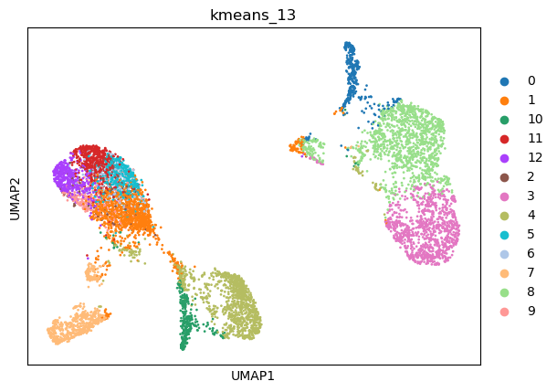
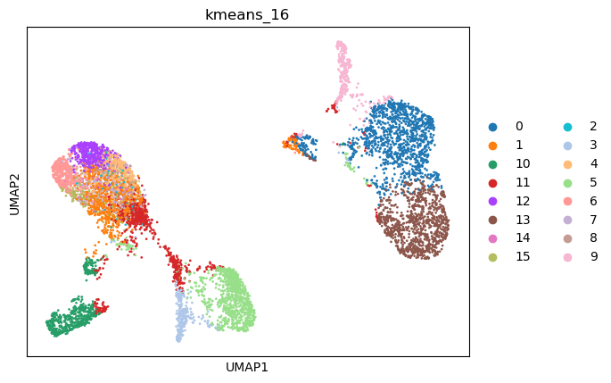
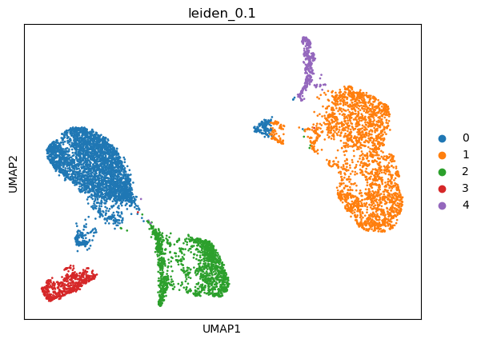
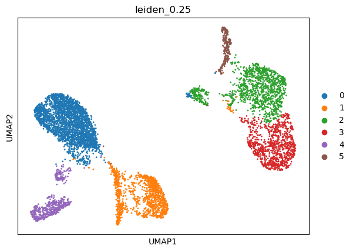
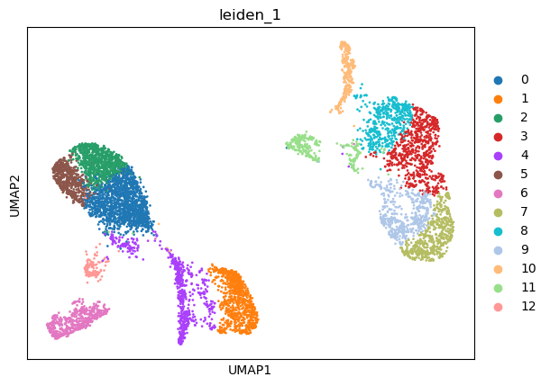
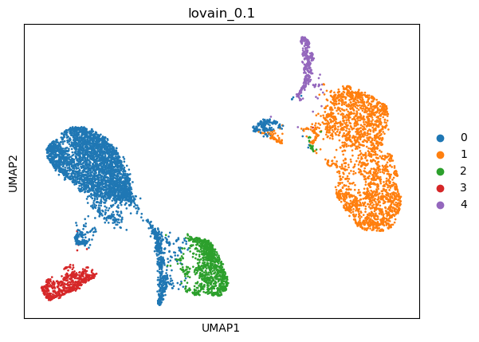
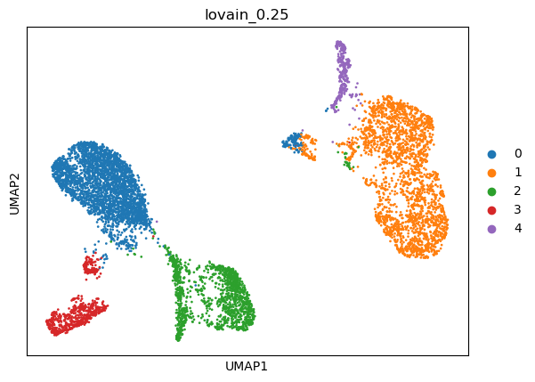
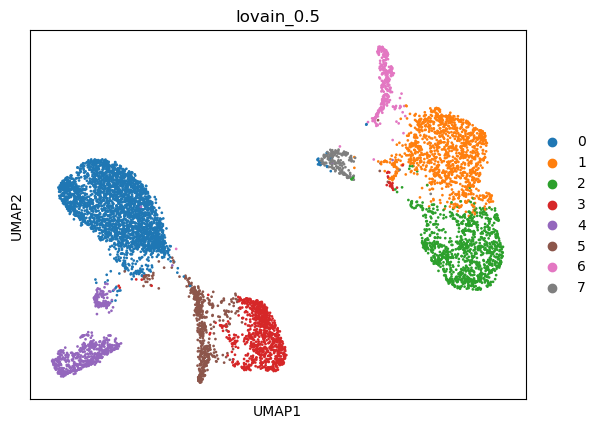
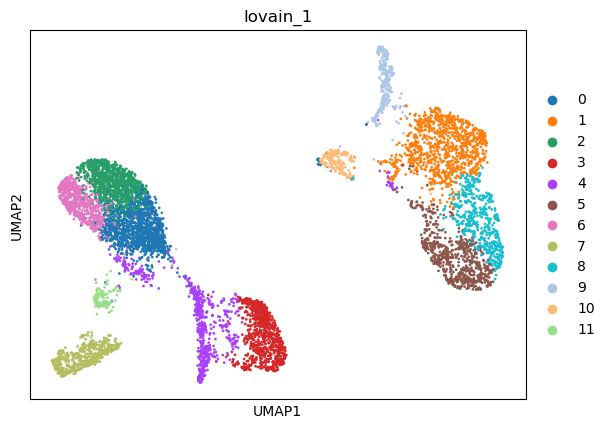

|   kmeans_13 | mr_two_column     |
|------------:|:------------------|
|           0 | Epithelial cells  |
|           1 | T helper cells    |
|          10 | Endothelial cells |
|          11 | T cells           |
|          12 | T memory cells    |
|           2 | T cells           |
|           3 | Keratinocytes     |
|           4 | Fibroblasts       |
|           5 | T cells           |
|           6 | T memory cells    |
|           7 | Macrophages       |
|           8 | Keratinocytes     |
|           9 | T memory cells    |
---

|   kmeans_16 | mr_two_column     |
|------------:|:------------------|
|           0 | Keratinocytes     |
|           1 | T cells           |
|          10 | Macrophages       |
|          11 | Interneurons      |
|          12 | T cells           |
|          13 | Keratinocytes     |
|          14 | T cells           |
|          15 | T memory cells    |
|           2 | T cells           |
|           3 | Endothelial cells |
|           4 | T cells           |
|           5 | Fibroblasts       |
|           6 | T cells           |
|           7 | T memory cells    |
|           8 | T memory cells    |
|           9 | Epithelial cells  |
---

|   leiden_0.1 | mr_two_column    |
|-------------:|:-----------------|
|            0 | T cells          |
|            1 | Keratinocytes    |
|            2 | Fibroblasts      |
|            3 | Macrophages      |
|            4 | Epithelial cells |
---

|   leiden_0.25 | mr_two_column     |
|--------------:|:------------------|
|             0 | T cells           |
|             1 | Endothelial cells |
|             2 | Keratinocytes     |
|             3 | Keratinocytes     |
|             4 | Macrophages       |
|             5 | Epithelial cells  |
---

|   leiden_0.5 | mr_two_column     |
|-------------:|:------------------|
|            0 | T cells           |
|            1 | Keratinocytes     |
|            2 | Keratinocytes     |
|            3 | Fibroblasts       |
|            4 | Monocytes         |
|            5 | Endothelial cells |
|            6 | Epithelial cells  |
|            7 | Keratinocytes     |
---

|   leiden_1 | mr_two_column     |
|-----------:|:------------------|
|          0 | T cells           |
|          1 | Fibroblasts       |
|          2 | T cells           |
|          3 | Keratinocytes     |
|          4 | Endothelial cells |
|          5 | T cells           |
|          6 | Macrophages       |
|          7 | Keratinocytes     |
|          8 | Keratinocytes     |
|          9 | Endothelial cells |
|         10 | Epithelial cells  |
|         11 | Keratinocytes     |
|         12 | B cells           |
---

|   lovain_0.1 | mr_two_column    |
|-------------:|:-----------------|
|            0 | T cells          |
|            1 | Keratinocytes    |
|            2 | Fibroblasts      |
|            3 | Macrophages      |
|            4 | Epithelial cells |
---

|   lovain_0.25 | mr_two_column     |
|--------------:|:------------------|
|             0 | T cells           |
|             1 | Keratinocytes     |
|             2 | Endothelial cells |
|             3 | Macrophages       |
|             4 | Epithelial cells  |
---

|   lovain_0.5 | mr_two_column     |
|-------------:|:------------------|
|            0 | T cells           |
|            1 | Keratinocytes     |
|            2 | Keratinocytes     |
|            3 | Fibroblasts       |
|            4 | Macrophages       |
|            5 | Endothelial cells |
|            6 | Epithelial cells  |
|            7 | Keratinocytes     |
---

|   lovain_1 | mr_two_column     |
|-----------:|:------------------|
|          0 | T memory cells    |
|          1 | Keratinocytes     |
|          2 | T cells           |
|          3 | Fibroblasts       |
|          4 | Endothelial cells |
|          5 | Interneurons      |
|          6 | T memory cells    |
|          7 | Macrophages       |
|          8 | Keratinocytes     |
|          9 | Epithelial cells  |
|         10 | Keratinocytes     |
|         11 | B cells           |
---
