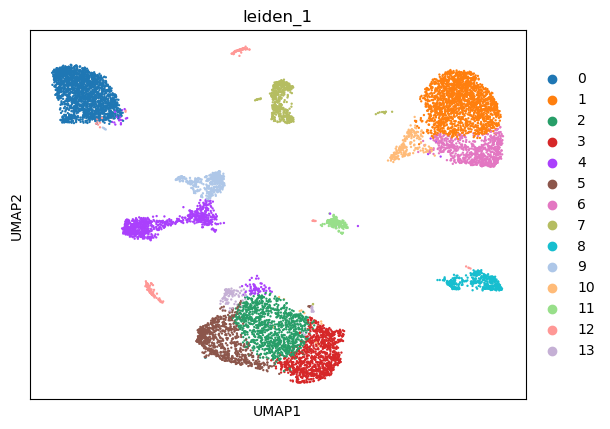

|   kmeans_13 | mr_two_column       |
|------------:|:--------------------|
|           0 | Fibroblasts         |
|           1 | Fibroblasts         |
|           2 | Macrophages         |
|           3 | Smooth muscle cells |
|           4 | Macrophages         |
|           5 | Fibroblasts         |
|           6 | Endothelial cells   |
|           7 | Macrophages         |
|           8 | Pericytes           |
|           9 | Schwann cells       |
|          10 | Epiblast cells      |
|          11 | Fibroblasts         |
|          12 | T cells             |
---

|   kmeans_16 | mr_two_column               |
|------------:|:----------------------------|
|           0 | Smooth muscle cells         |
|           1 | Fibroblasts                 |
|           2 | Macrophages                 |
|           3 | Epiblast cells              |
|           4 | Smooth muscle cells         |
|           5 | Fibroblasts                 |
|           6 | Pericytes                   |
|           7 | Microglia                   |
|           8 | Macrophages                 |
|           9 | Fibroblasts                 |
|          10 | Schwann cells               |
|          11 | Fibroblasts                 |
|          12 | Endothelial cells           |
|          13 | Neural stem/precursor cells |
|          14 | T cells                     |
|          15 | Kupffer cells               |
---

|   leiden_0.1 | mr_two_column               |
|-------------:|:----------------------------|
|            0 | Fibroblasts                 |
|            1 | Smooth muscle cells         |
|            2 | Macrophages                 |
|            3 | Neural stem/precursor cells |
|            4 | Pericytes                   |
|            5 | Fibroblasts                 |
---

|   leiden_0.25 | mr_two_column       |
|--------------:|:--------------------|
|             0 | Fibroblasts         |
|             1 | Smooth muscle cells |
|             2 | Macrophages         |
|             3 | Platelets           |
|             4 | Schwann cells       |
|             5 | Pericytes           |
|             6 | Fibroblasts         |
---

|   leiden_0.5 | mr_two_column       |
|-------------:|:--------------------|
|            0 | Smooth muscle cells |
|            1 | Fibroblasts         |
|            2 | Macrophages         |
|            3 | T cells             |
|            4 | Fibroblasts         |
|            5 | Schwann cells       |
|            6 | Pericytes           |
|            7 | Endothelial cells   |
|            8 | Fibroblasts         |
|            9 | Fibroblasts         |
|           10 | Fibroblasts         |
---

|   leiden_1 | mr_two_column             |
|-----------:|:--------------------------|
|          0 | Macrophages               |
|          1 | Smooth muscle cells       |
|          2 | Fibroblasts               |
|          3 | Fibroblasts               |
|          4 | T cells                   |
|          5 | Fibroblasts               |
|          6 | Smooth muscle cells       |
|          7 | Schwann cells             |
|          8 | Pericytes                 |
|          9 | Endothelial cells         |
|         10 | Fibroblasts               |
|         11 | Fibroblasts               |
|         12 | Microglia                 |
|         13 | Pancreatic stellate cells |
---

|   lovain_0.1 | mr_two_column       |
|-------------:|:--------------------|
|            0 | Fibroblasts         |
|            1 | Smooth muscle cells |
|            2 | Macrophages         |
|            3 | Platelets           |
|            4 | Schwann cells       |
|            5 | Pericytes           |
---

|   lovain_0.25 | mr_two_column       |
|--------------:|:--------------------|
|             0 | Fibroblasts         |
|             1 | Smooth muscle cells |
|             2 | Macrophages         |
|             3 | Platelets           |
|             4 | Schwann cells       |
|             5 | Pericytes           |
|             6 | Fibroblasts         |
---

|   lovain_0.5 | mr_two_column       |
|-------------:|:--------------------|
|            0 | Fibroblasts         |
|            1 | Smooth muscle cells |
|            2 | Macrophages         |
|            3 | Platelets           |
|            4 | Schwann cells       |
|            5 | Pericytes           |
|            6 | Fibroblasts         |
|            7 | Fibroblasts         |
---

|   lovain_1 | mr_two_column       |
|-----------:|:--------------------|
|          0 | Macrophages         |
|          1 | Smooth muscle cells |
|          2 | Fibroblasts         |
|          3 | Fibroblasts         |
|          4 | T cells             |
|          5 | Smooth muscle cells |
|          6 | Schwann cells       |
|          7 | Pericytes           |
|          8 | Endothelial cells   |
|          9 | Fibroblasts         |
|         10 | Fibroblasts         |
|         11 | Fibroblasts         |
---
