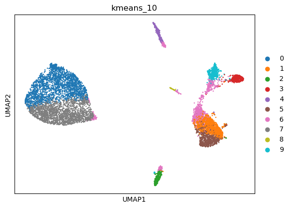
|   kmeans_10 | mr_two_column   |
|------------:|:----------------|
|           0 | Neurons         |
|           1 | Macrophages     |
|           2 | Macrophages     |
|           3 | Interneurons    |
|           4 | Fibroblasts     |
|           5 | Neurons         |
|           6 | Interneurons    |
|           7 | Neurons         |
|           8 | Foveolar cells  |
|           9 | Fibroblasts     |
---
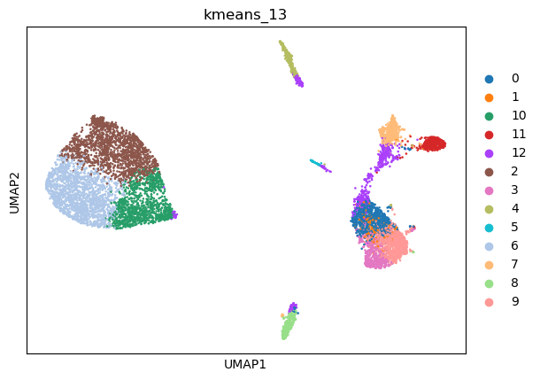
|   kmeans_13 | mr_two_column     |
|------------:|:------------------|
|           0 | Macrophages       |
|           1 | Monocytes         |
|          10 | Interneurons      |
|          11 | Interneurons      |
|          12 | Interneurons      |
|           2 | Endothelial cells |
|           3 | Neurons           |
|           4 | Fibroblasts       |
|           5 | Foveolar cells    |
|           6 | Neurons           |
|           7 | Enterocytes       |
|           8 | Macrophages       |
|           9 | Interneurons      |
---
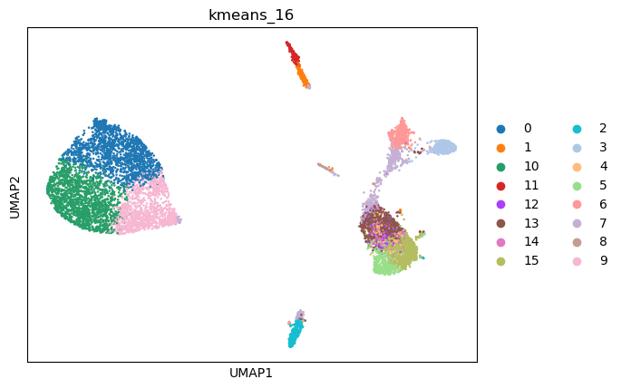
|   kmeans_16 | mr_two_column              |
|------------:|:---------------------------|
|           0 | Endothelial cells          |
|           1 | Sertoli cells              |
|          10 | Neurons                    |
|          11 | Fibroblasts                |
|          12 | Trigeminal neurons         |
|          13 | Interneurons               |
|          14 | Neurons                    |
|          15 | Interneurons               |
|           2 | Macrophages                |
|           3 | Interneurons               |
|           4 | Mesangial cells            |
|           5 | Neurons                    |
|           6 | Fibroblasts                |
|           7 | Olfactory epithelial cells |
|           8 | Foveolar cells             |
|           9 | Interneurons               |
---
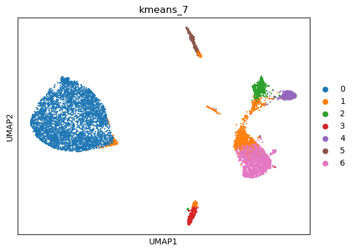
|   kmeans_7 | mr_two_column   |
|-----------:|:----------------|
|          0 | Neurons         |
|          1 | Interneurons    |
|          2 | Fibroblasts     |
|          3 | Macrophages     |
|          4 | Interneurons    |
|          5 | Fibroblasts     |
|          6 | Interneurons    |
---
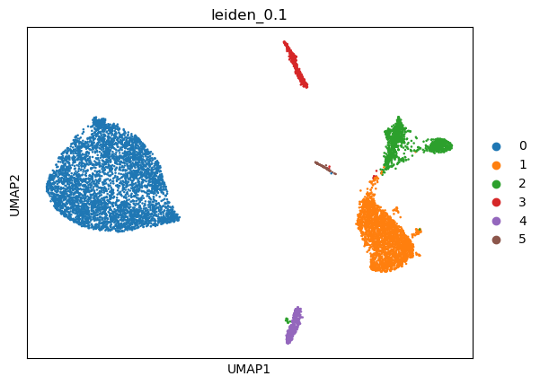
|   leiden_0.1 | mr_two_column       |
|-------------:|:--------------------|
|            0 | Neurons             |
|            1 | Interneurons        |
|            2 | Fibroblasts         |
|            3 | Cajal-Retzius cells |
|            4 | Fibroblasts         |
|            5 | Macrophages         |
---
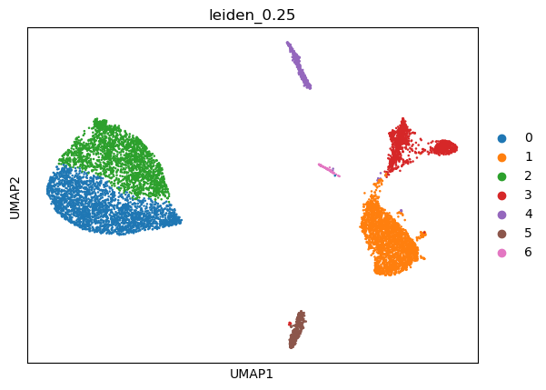
|   leiden_0.25 | mr_two_column       |
|--------------:|:--------------------|
|             0 | Neurons             |
|             1 | Interneurons        |
|             2 | Endothelial cells   |
|             3 | Fibroblasts         |
|             4 | Cajal-Retzius cells |
|             5 | Macrophages         |
|             6 | Macrophages         |
---
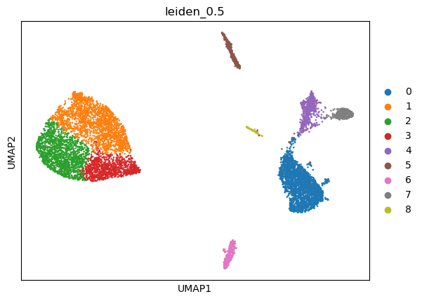
|   leiden_0.5 | mr_two_column       |
|-------------:|:--------------------|
|            0 | Interneurons        |
|            1 | Enterocytes         |
|            2 | Neurons             |
|            3 | Interneurons        |
|            4 | Interneurons        |
|            5 | Cajal-Retzius cells |
|            6 | Fibroblasts         |
|            7 | Fibroblasts         |
|            8 | Macrophages         |
---
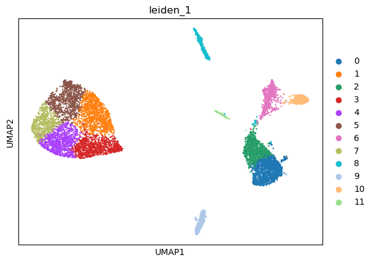
|   leiden_1 | mr_two_column       |
|-----------:|:--------------------|
|          0 | Interneurons        |
|          1 | Endothelial cells   |
|          2 | Platelets           |
|          3 | Interneurons        |
|          4 | Neurons             |
|          5 | Enterocytes         |
|          6 | Interneurons        |
|          7 | Neurons             |
|          8 | Cajal-Retzius cells |
|          9 | Macrophages         |
|         10 | Fibroblasts         |
|         11 | Macrophages         |
---
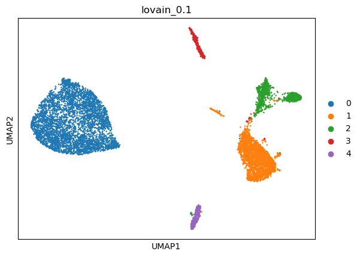
|   lovain_0.1 | mr_two_column       |
|-------------:|:--------------------|
|            0 | Neurons             |
|            1 | Interneurons        |
|            2 | Interneurons        |
|            3 | Cajal-Retzius cells |
|            4 | Macrophages         |
---
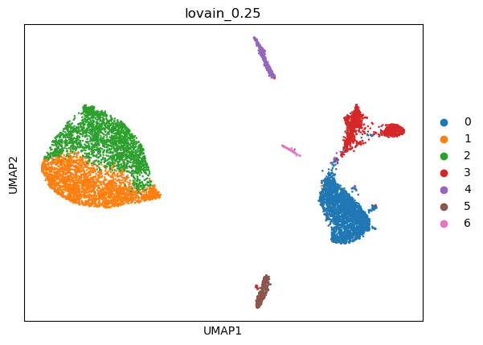
|   lovain_0.25 | mr_two_column       |
|--------------:|:--------------------|
|             0 | Interneurons        |
|             1 | Neurons             |
|             2 | Enterocytes         |
|             3 | Interneurons        |
|             4 | Cajal-Retzius cells |
|             5 | Macrophages         |
|             6 | Macrophages         |
---
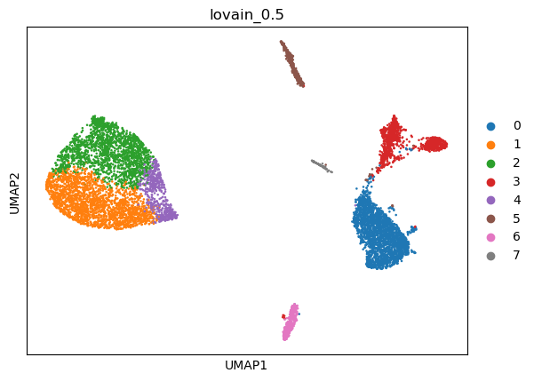
|   lovain_0.5 | mr_two_column       |
|-------------:|:--------------------|
|            0 | Interneurons        |
|            1 | Neurons             |
|            2 | Enterocytes         |
|            3 | Interneurons        |
|            4 | Enterocytes         |
|            5 | Cajal-Retzius cells |
|            6 | Macrophages         |
|            7 | Macrophages         |
---
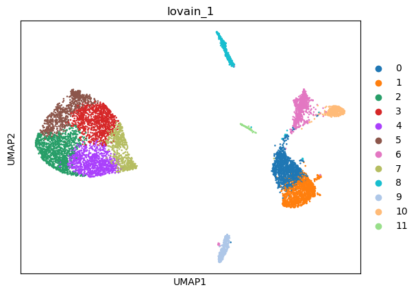
|   lovain_1 | mr_two_column       |
|-----------:|:--------------------|
|          0 | Macrophages         |
|          1 | Interneurons        |
|          2 | Neurons             |
|          3 | Endothelial cells   |
|          4 | Neurons             |
|          5 | Neurons             |
|          6 | Interneurons        |
|          7 | Interneurons        |
|          8 | Cajal-Retzius cells |
|          9 | Macrophages         |
|         10 | Interneurons        |
|         11 | Macrophages         |
---
