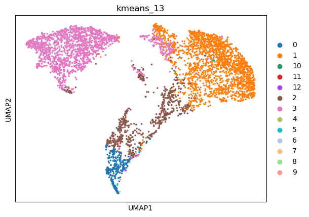
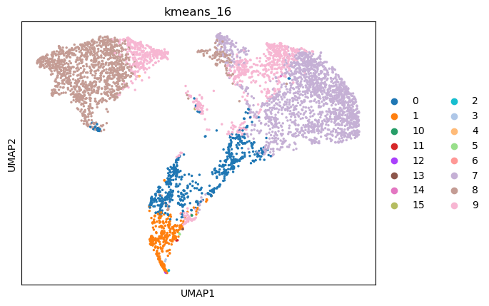
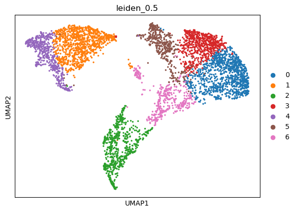
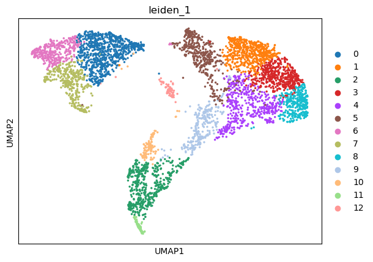
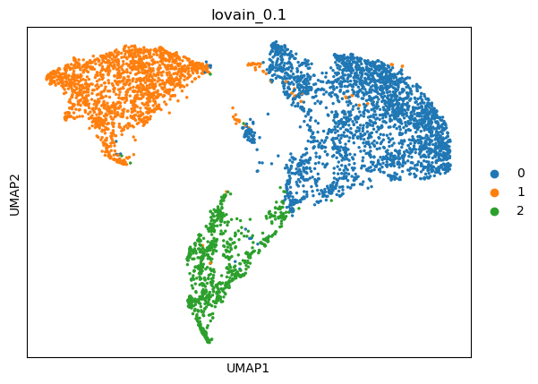
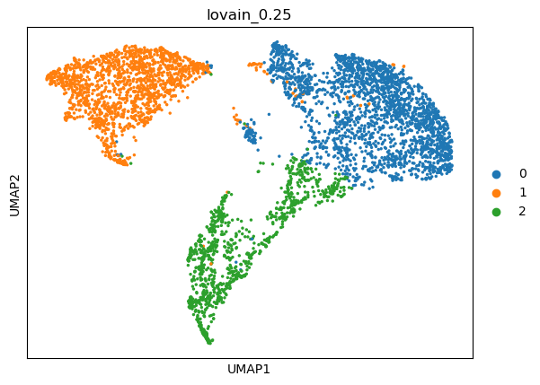
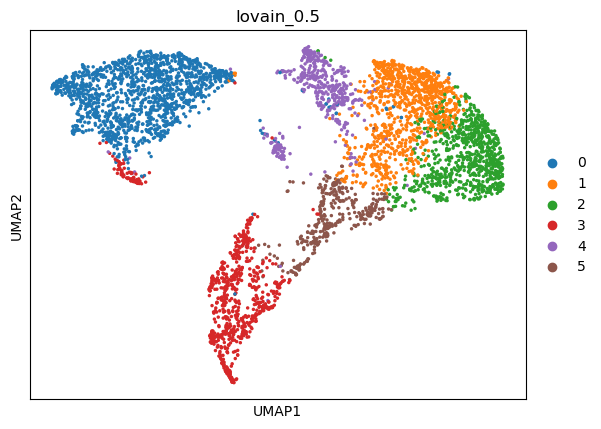
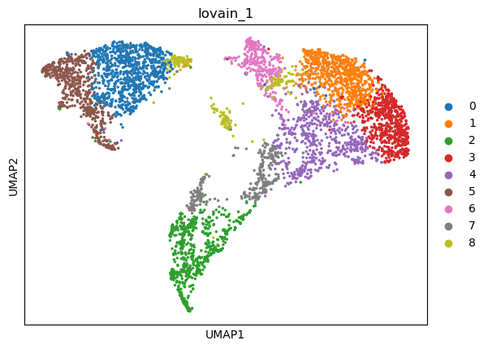

|   kmeans_13 | mr_two_column   |
|------------:|:----------------|
|           0 | Interneurons    |
|           1 | Beta cells      |
|          10 | Enteric neurons |
|          11 | Pericytes       |
|          12 | Neurons         |
|           2 | Interneurons    |
|           3 | Alpha cells     |
|           4 | Chondrocytes    |
|           5 | Basal cells     |
|           6 | Neurons         |
|           7 | Adipocytes      |
|           8 | NK cells        |
|           9 | Neurons         |
---

|   kmeans_16 | mr_two_column             |
|------------:|:--------------------------|
|           0 | Interneurons              |
|           1 | Neurons                   |
|          10 | NK cells                  |
|          11 | Neurons                   |
|          12 | Endothelial cells         |
|          13 | Adipocytes                |
|          14 | Endothelial cells (aorta) |
|          15 | Pericytes                 |
|           2 | Neurons                   |
|           3 | Basal cells               |
|           4 | Endothelial cells (aorta) |
|           5 | Sertoli cells             |
|           6 | Chondrocytes              |
|           7 | Beta cells                |
|           8 | Alpha cells               |
|           9 | Cholangiocytes            |
---

|   leiden_0.1 | mr_two_column   |
|-------------:|:----------------|
|            0 | Beta cells      |
|            1 | Alpha cells     |
|            2 | Interneurons    |
---

|   leiden_0.25 | mr_two_column   |
|--------------:|:----------------|
|             0 | Beta cells      |
|             1 | Alpha cells     |
|             2 | Interneurons    |
---

|   leiden_0.5 | mr_two_column   |
|-------------:|:----------------|
|            0 | Beta cells      |
|            1 | Alpha cells     |
|            2 | Interneurons    |
|            3 | Beta cells      |
|            4 | Alpha cells     |
|            5 | Delta cells     |
|            6 | Ductal cells    |
---

|   leiden_1 | mr_two_column   |
|-----------:|:----------------|
|          0 | Alpha cells     |
|          1 | Beta cells      |
|          2 | Interneurons    |
|          3 | Beta cells      |
|          4 | Beta cells      |
|          5 | Delta cells     |
|          6 | Alpha cells     |
|          7 | Alpha cells     |
|          8 | Beta cells      |
|          9 | Interneurons    |
|         10 | Interneurons    |
|         11 | Interneurons    |
|         12 | Acinar cells    |
---

|   lovain_0.1 | mr_two_column   |
|-------------:|:----------------|
|            0 | Beta cells      |
|            1 | Alpha cells     |
|            2 | Interneurons    |
---

|   lovain_0.25 | mr_two_column   |
|--------------:|:----------------|
|             0 | Beta cells      |
|             1 | Alpha cells     |
|             2 | Interneurons    |
---

|   lovain_0.5 | mr_two_column   |
|-------------:|:----------------|
|            0 | Alpha cells     |
|            1 | Beta cells      |
|            2 | Beta cells      |
|            3 | Interneurons    |
|            4 | Delta cells     |
|            5 | Neurons         |
---

|   lovain_1 | mr_two_column    |
|-----------:|:-----------------|
|          0 | Alpha cells      |
|          1 | Beta cells       |
|          2 | Interneurons     |
|          3 | Beta cells       |
|          4 | Beta cells       |
|          5 | Alpha cells      |
|          6 | Delta cells      |
|          7 | Epithelial cells |
|          8 | Acinar cells     |
---
