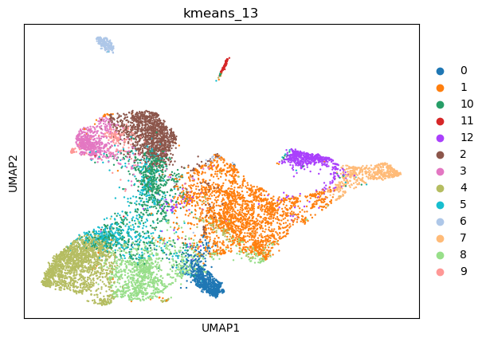
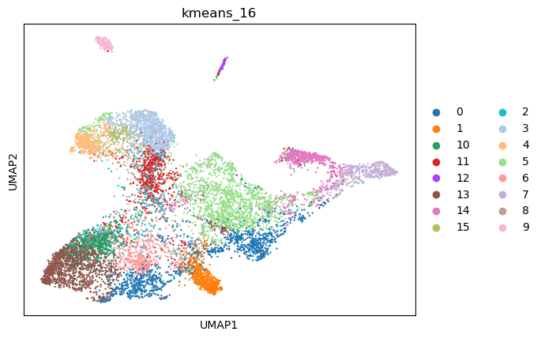
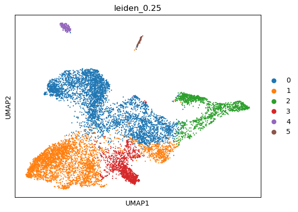
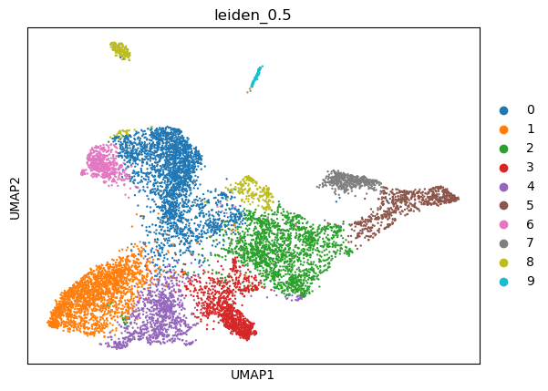
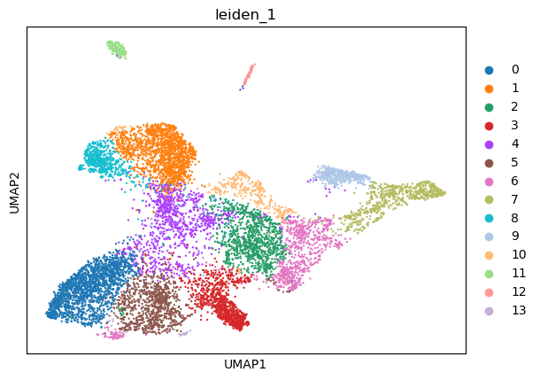
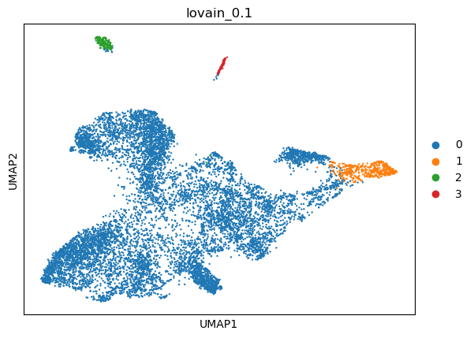
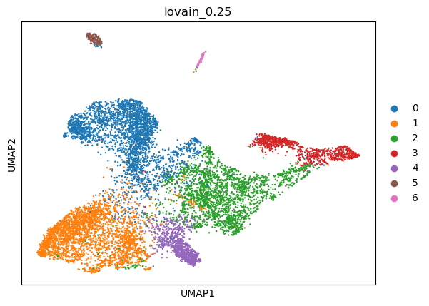
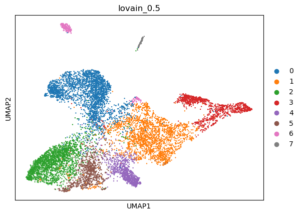
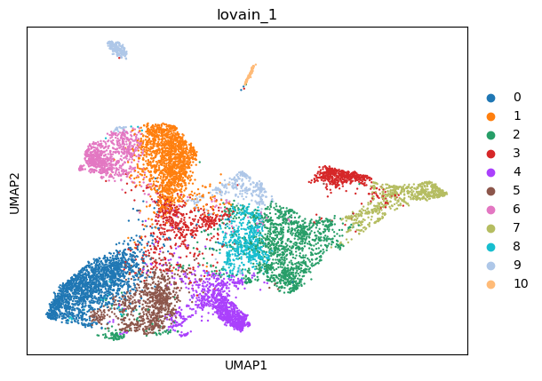

|   kmeans_13 | mr_two_column              |
|------------:|:---------------------------|
|           0 | Podocytes                  |
|           1 | Endothelial cells          |
|          10 | Foveolar cells             |
|          11 | Macrophages                |
|          12 | Principal cells            |
|           2 | Fibroblasts                |
|           3 | Fibroblasts                |
|           4 | Interneurons               |
|           5 | Olfactory epithelial cells |
|           6 | Endothelial cells          |
|           7 | Epithelial cells           |
|           8 | Interneurons               |
|           9 | Fibroblasts                |
---

|   kmeans_16 | mr_two_column     |
|------------:|:------------------|
|           0 | Interneurons      |
|           1 | Podocytes         |
|          10 | Interneurons      |
|          11 | Germ cells        |
|          12 | Macrophages       |
|          13 | Interneurons      |
|          14 | Principal cells   |
|          15 | Fibroblasts       |
|           2 | Enterocytes       |
|           3 | Fibroblasts       |
|           4 | Fibroblasts       |
|           5 | Endothelial cells |
|           6 | Interneurons      |
|           7 | Epithelial cells  |
|           8 | Monocytes         |
|           9 | Endothelial cells |
---

|   leiden_0.1 | mr_two_column     |
|-------------:|:------------------|
|            0 | Fibroblasts       |
|            1 | Principal cells   |
|            2 | Endothelial cells |
|            3 | Macrophages       |
---

|   leiden_0.25 | mr_two_column     |
|--------------:|:------------------|
|             0 | Fibroblasts       |
|             1 | Interneurons      |
|             2 | Principal cells   |
|             3 | Podocytes         |
|             4 | Endothelial cells |
|             5 | Macrophages       |
---

|   leiden_0.5 | mr_two_column             |
|-------------:|:--------------------------|
|            0 | Pancreatic stellate cells |
|            1 | Interneurons              |
|            2 | Interneurons              |
|            3 | Podocytes                 |
|            4 | Interneurons              |
|            5 | Epithelial cells          |
|            6 | Fibroblasts               |
|            7 | Principal cells           |
|            8 | Endothelial cells         |
|            9 | Macrophages               |
---

|   leiden_1 | mr_two_column         |
|-----------:|:----------------------|
|          0 | Interneurons          |
|          1 | Fibroblasts           |
|          2 | Fibroblasts           |
|          3 | Podocytes             |
|          4 | Proximal tubule cells |
|          5 | Interneurons          |
|          6 | Interneurons          |
|          7 | Epithelial cells      |
|          8 | Fibroblasts           |
|          9 | Principal cells       |
|         10 | Endothelial cells     |
|         11 | Endothelial cells     |
|         12 | Macrophages           |
|         13 | Interneurons          |
---

|   lovain_0.1 | mr_two_column     |
|-------------:|:------------------|
|            0 | Neurons           |
|            1 | Epithelial cells  |
|            2 | Endothelial cells |
|            3 | Macrophages       |
---

|   lovain_0.25 | mr_two_column     |
|--------------:|:------------------|
|             0 | Fibroblasts       |
|             1 | Interneurons      |
|             2 | Interneurons      |
|             3 | Principal cells   |
|             4 | Podocytes         |
|             5 | Endothelial cells |
|             6 | Macrophages       |
---

|   lovain_0.5 | mr_two_column     |
|-------------:|:------------------|
|            0 | Fibroblasts       |
|            1 | Interneurons      |
|            2 | Interneurons      |
|            3 | Principal cells   |
|            4 | Podocytes         |
|            5 | Interneurons      |
|            6 | Endothelial cells |
|            7 | Macrophages       |
---

|   lovain_1 | mr_two_column     |
|-----------:|:------------------|
|          0 | Interneurons      |
|          1 | Fibroblasts       |
|          2 | Interneurons      |
|          3 | Ductal cells      |
|          4 | Podocytes         |
|          5 | Interneurons      |
|          6 | Fibroblasts       |
|          7 | Epithelial cells  |
|          8 | Fibroblasts       |
|          9 | Endothelial cells |
|         10 | Macrophages       |
---
