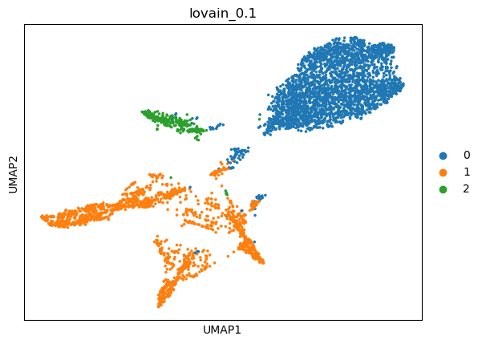
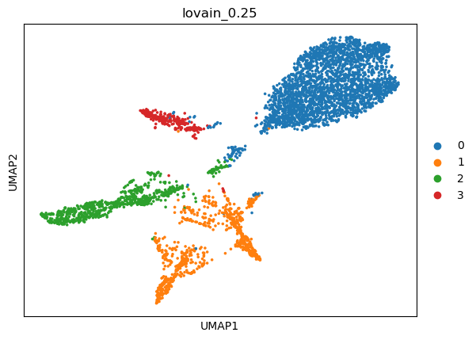

|   kmeans_13 | mr_two_column                   |
|------------:|:--------------------------------|
|           0 | Monocytes                       |
|           1 | Fibroblasts                     |
|          10 | T cells                         |
|          11 | Macrophages                     |
|          12 | Macrophages                     |
|           2 | Pulmonary alveolar type I cells |
|           3 | Macrophages                     |
|           4 | Monocytes                       |
|           5 | Dendritic cells                 |
|           6 | Endothelial cells               |
|           7 | Microglia                       |
|           8 | Microglia                       |
|           9 | Interneurons                    |
---

|   kmeans_16 | mr_two_column                   |
|------------:|:--------------------------------|
|           0 | Peritubular myoid cells         |
|           1 | Macrophages                     |
|          10 | Macrophages                     |
|          11 | Neural stem/precursor cells     |
|          12 | Microfold cells                 |
|          13 | Fibroblasts                     |
|          14 | Macrophages                     |
|          15 | Endothelial cells               |
|           2 | Pulmonary alveolar type I cells |
|           3 | Interneurons                    |
|           4 | T cells                         |
|           5 | Platelets                       |
|           6 | Macrophages                     |
|           7 | Monocytes                       |
|           8 | Monocytes                       |
|           9 | Microglia                       |
---

|   leiden_0.1 | mr_two_column                   |
|-------------:|:--------------------------------|
|            0 | Macrophages                     |
|            1 | Pulmonary alveolar type I cells |
|            2 | Endothelial cells               |
|            3 | T cells                         |
---

|   leiden_0.25 | mr_two_column                   |
|--------------:|:--------------------------------|
|             0 | Macrophages                     |
|             1 | Pulmonary alveolar type I cells |
|             2 | Endothelial cells               |
|             3 | T cells                         |
---

|   leiden_0.5 | mr_two_column                   |
|-------------:|:--------------------------------|
|            0 | Macrophages                     |
|            1 | Macrophages                     |
|            2 | Pulmonary alveolar type I cells |
|            3 | Endothelial cells               |
|            4 | Fibroblasts                     |
|            5 | T cells                         |
|            6 | Interneurons                    |
---

|   leiden_1 | mr_two_column                   |
|-----------:|:--------------------------------|
|          0 | Monocytes                       |
|          1 | Macrophages                     |
|          2 | Macrophages                     |
|          3 | Pulmonary alveolar type I cells |
|          4 | Epithelial cells                |
|          5 | Fibroblasts                     |
|          6 | T cells                         |
|          7 | Endothelial cells               |
|          8 | Endothelial cells               |
|          9 | Interneurons                    |
---

|   lovain_0.1 | mr_two_column     |
|-------------:|:------------------|
|            0 | Macrophages       |
|            1 | Endothelial cells |
|            2 | T cells           |
---

|   lovain_0.25 | mr_two_column                   |
|--------------:|:--------------------------------|
|             0 | Macrophages                     |
|             1 | Endothelial cells               |
|             2 | Pulmonary alveolar type I cells |
|             3 | NK cells                        |
---

|   lovain_0.5 | mr_two_column                   |
|-------------:|:--------------------------------|
|            0 | Macrophages                     |
|            1 | Macrophages                     |
|            2 | Pulmonary alveolar type I cells |
|            3 | Endothelial cells               |
|            4 | Fibroblasts                     |
|            5 | NK cells                        |
---

|   lovain_1 | mr_two_column                   |
|-----------:|:--------------------------------|
|          0 | Macrophages                     |
|          1 | Macrophages                     |
|          2 | Macrophages                     |
|          3 | Endothelial cells               |
|          4 | Pulmonary alveolar type I cells |
|          5 | Cholangiocytes                  |
|          6 | Fibroblasts                     |
|          7 | T cells                         |
---
