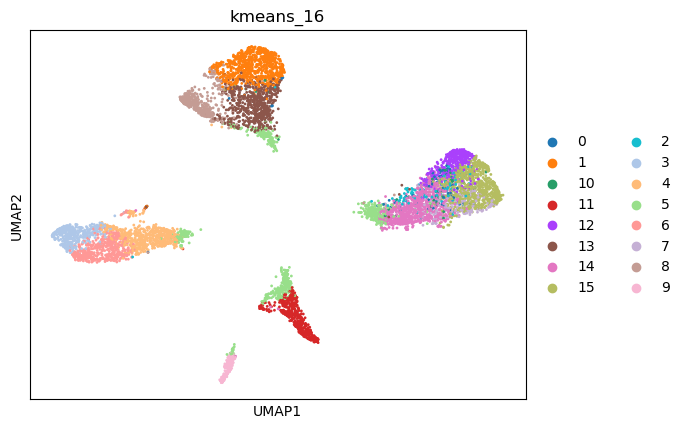

|   kmeans_13 | mr_two_column            |
|------------:|:-------------------------|
|           0 | Adipocytes               |
|           1 | Fibroblasts              |
|          10 | Beta cells               |
|          11 | Luminal epithelial cells |
|          12 | Basal cells              |
|           2 | Myoepithelial cells      |
|           3 | Luminal epithelial cells |
|           4 | Endothelial cells        |
|           5 | Myoepithelial cells      |
|           6 | Epithelial cells         |
|           7 | Ductal cells             |
|           8 | Hepatocytes              |
|           9 | Luminal epithelial cells |
---

|   kmeans_16 | mr_two_column                   |
|------------:|:--------------------------------|
|           0 | Luminal epithelial cells        |
|           1 | Ductal cells                    |
|          10 | Pulmonary alveolar type I cells |
|          11 | Fibroblasts                     |
|          12 | Interneurons                    |
|          13 | Epithelial cells                |
|          14 | Interneurons                    |
|          15 | Luminal epithelial cells        |
|           2 | Luminal epithelial cells        |
|           3 | Myoepithelial cells             |
|           4 | Myoepithelial cells             |
|           5 | Beta cells                      |
|           6 | Myoepithelial cells             |
|           7 | Luminal epithelial cells        |
|           8 | Basal cells                     |
|           9 | Endothelial cells               |
---

|   leiden_0.1 | mr_two_column            |
|-------------:|:-------------------------|
|            0 | Luminal epithelial cells |
|            1 | Epithelial cells         |
|            2 | Myoepithelial cells      |
|            3 | Fibroblasts              |
---

|   leiden_0.25 | mr_two_column            |
|--------------:|:-------------------------|
|             0 | Luminal epithelial cells |
|             1 | Epithelial cells         |
|             2 | Myoepithelial cells      |
|             3 | Fibroblasts              |
|             4 | Endothelial cells        |
---

|   leiden_0.5 | mr_two_column            |
|-------------:|:-------------------------|
|            0 | Luminal epithelial cells |
|            1 | Myoepithelial cells      |
|            2 | Epithelial cells         |
|            3 | Fibroblasts              |
|            4 | Basal cells              |
|            5 | Endothelial cells        |
---

|   leiden_1 | mr_two_column            |
|-----------:|:-------------------------|
|          0 | Hepatocytes              |
|          1 | Myoepithelial cells      |
|          2 | Epithelial cells         |
|          3 | Luminal epithelial cells |
|          4 | Luminal epithelial cells |
|          5 | Cardiomyocytes           |
|          6 | Fibroblasts              |
|          7 | Myoepithelial cells      |
|          8 | Basal cells              |
|          9 | Endothelial cells        |
|         10 | Myoepithelial cells      |
---

|   lovain_0.1 | mr_two_column            |
|-------------:|:-------------------------|
|            0 | Luminal epithelial cells |
|            1 | Epithelial cells         |
|            2 | Myoepithelial cells      |
|            3 | Fibroblasts              |
---

|   lovain_0.25 | mr_two_column            |
|--------------:|:-------------------------|
|             0 | Luminal epithelial cells |
|             1 | Epithelial cells         |
|             2 | Myoepithelial cells      |
|             3 | Fibroblasts              |
|             4 | Endothelial cells        |
---

|   lovain_0.5 | mr_two_column            |
|-------------:|:-------------------------|
|            0 | Luminal epithelial cells |
|            1 | Myoepithelial cells      |
|            2 | Epithelial cells         |
|            3 | Fibroblasts              |
|            4 | Basal cells              |
|            5 | Endothelial cells        |
---

|   lovain_1 | mr_two_column            |
|-----------:|:-------------------------|
|          0 | Luminal epithelial cells |
|          1 | Hepatocytes              |
|          2 | Myoepithelial cells      |
|          3 | Ductal cells             |
|          4 | Epithelial cells         |
|          5 | Fibroblasts              |
|          6 | Myoepithelial cells      |
|          7 | Basal cells              |
|          8 | Endothelial cells        |
|          9 | Myoepithelial cells      |
---
