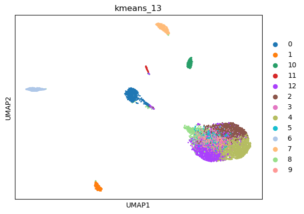
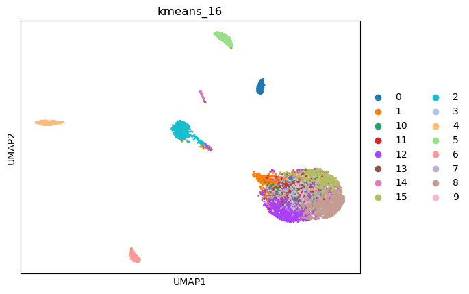
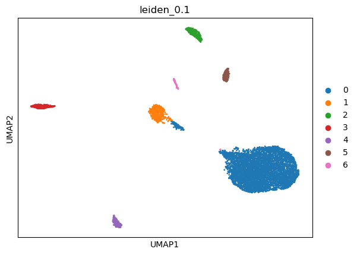
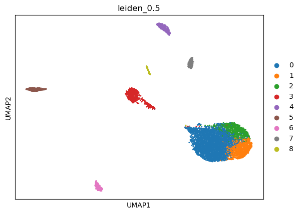
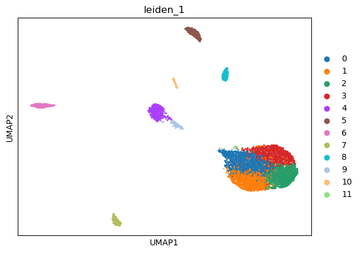
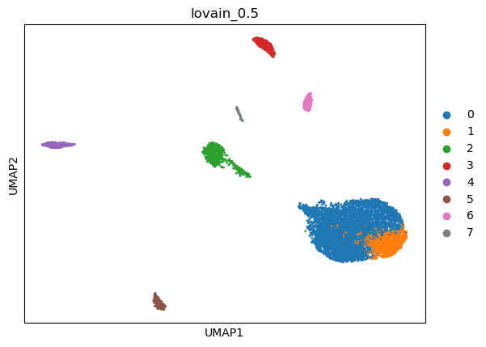
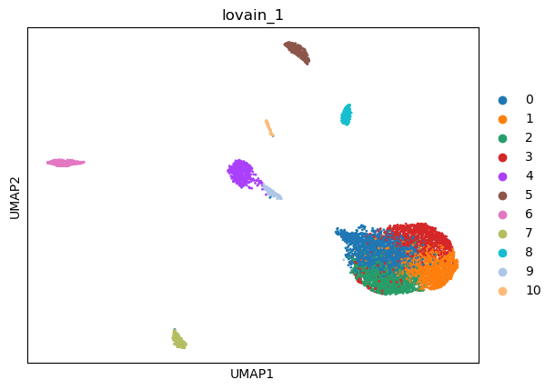

|   kmeans_13 | mr_two_column     |
|------------:|:------------------|
|           0 | Ductal cells      |
|           1 | T cells           |
|          10 | Alpha cells       |
|          11 | Endothelial cells |
|          12 | Acinar cells      |
|           2 | Acinar cells      |
|           3 | Acinar cells      |
|           4 | Acinar cells      |
|           5 | Acinar cells      |
|           6 | Macrophages       |
|           7 | Fibroblasts       |
|           8 | Enterocytes       |
|           9 | Acinar cells      |
---

|   kmeans_16 | mr_two_column     |
|------------:|:------------------|
|           0 | Alpha cells       |
|           1 | Cardiomyocytes    |
|          10 | Acinar cells      |
|          11 | Acinar cells      |
|          12 | Acinar cells      |
|          13 | Acinar cells      |
|          14 | Endothelial cells |
|          15 | Acinar cells      |
|           2 | Ductal cells      |
|           3 | Acinar cells      |
|           4 | Macrophages       |
|           5 | Fibroblasts       |
|           6 | T cells           |
|           7 | Acinar cells      |
|           8 | Acinar cells      |
|           9 | Acinar cells      |
---

|   leiden_0.1 | mr_two_column     |
|-------------:|:------------------|
|            0 | Acinar cells      |
|            1 | Ductal cells      |
|            2 | Fibroblasts       |
|            3 | Macrophages       |
|            4 | T cells           |
|            5 | Alpha cells       |
|            6 | Endothelial cells |
---

|   leiden_0.25 | mr_two_column     |
|--------------:|:------------------|
|             0 | Acinar cells      |
|             1 | Ductal cells      |
|             2 | Fibroblasts       |
|             3 | Macrophages       |
|             4 | T cells           |
|             5 | Alpha cells       |
|             6 | Endothelial cells |
---

|   leiden_0.5 | mr_two_column     |
|-------------:|:------------------|
|            0 | Acinar cells      |
|            1 | Acinar cells      |
|            2 | Acinar cells      |
|            3 | Ductal cells      |
|            4 | Fibroblasts       |
|            5 | Macrophages       |
|            6 | T cells           |
|            7 | Beta cells        |
|            8 | Endothelial cells |
---

|   leiden_1 | mr_two_column     |
|-----------:|:------------------|
|          0 | Acinar cells      |
|          1 | Acinar cells      |
|          2 | Acinar cells      |
|          3 | Acinar cells      |
|          4 | Ductal cells      |
|          5 | Fibroblasts       |
|          6 | Macrophages       |
|          7 | T cells           |
|          8 | Beta cells        |
|          9 | Enterocytes       |
|         10 | Endothelial cells |
|         11 | Monocytes         |
---

|   lovain_0.1 | mr_two_column     |
|-------------:|:------------------|
|            0 | Acinar cells      |
|            1 | Ductal cells      |
|            2 | Fibroblasts       |
|            3 | Macrophages       |
|            4 | T cells           |
|            5 | Alpha cells       |
|            6 | Endothelial cells |
---

|   lovain_0.25 | mr_two_column     |
|--------------:|:------------------|
|             0 | Acinar cells      |
|             1 | Ductal cells      |
|             2 | Fibroblasts       |
|             3 | Macrophages       |
|             4 | T cells           |
|             5 | Alpha cells       |
|             6 | Endothelial cells |
---

|   lovain_0.5 | mr_two_column     |
|-------------:|:------------------|
|            0 | Acinar cells      |
|            1 | Acinar cells      |
|            2 | Ductal cells      |
|            3 | Fibroblasts       |
|            4 | Macrophages       |
|            5 | T cells           |
|            6 | Alpha cells       |
|            7 | Endothelial cells |
---

|   lovain_1 | mr_two_column     |
|-----------:|:------------------|
|          0 | Acinar cells      |
|          1 | Acinar cells      |
|          2 | Acinar cells      |
|          3 | Acinar cells      |
|          4 | Ductal cells      |
|          5 | Fibroblasts       |
|          6 | Macrophages       |
|          7 | T cells           |
|          8 | Alpha cells       |
|          9 | Enterocytes       |
|         10 | Endothelial cells |
---
