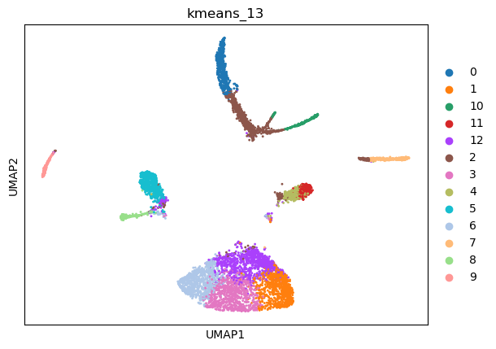
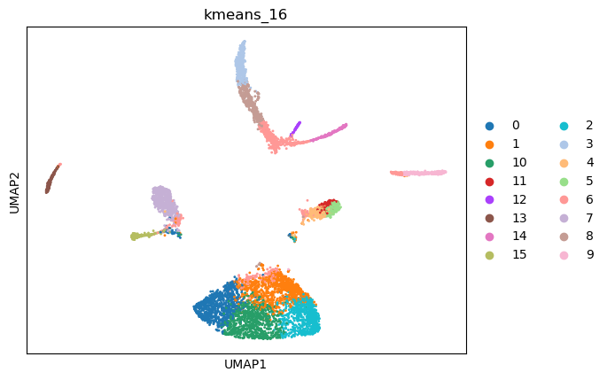
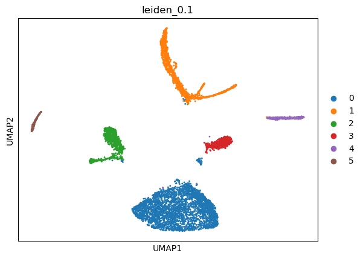
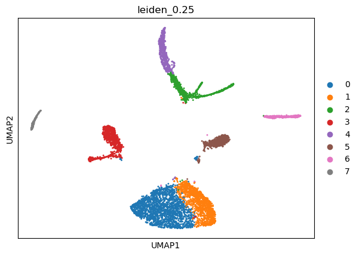
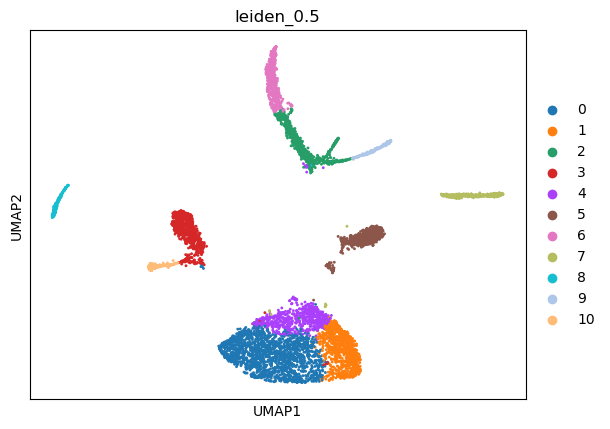
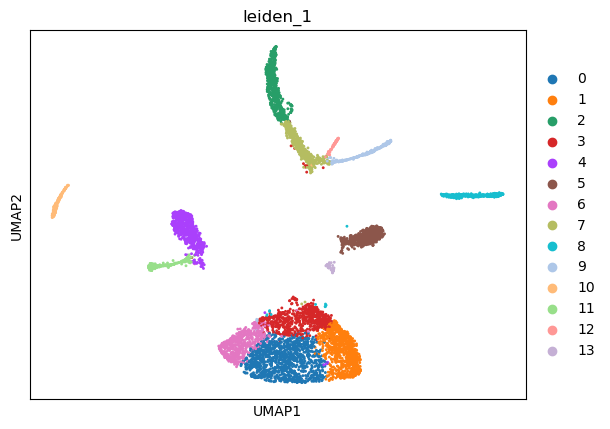
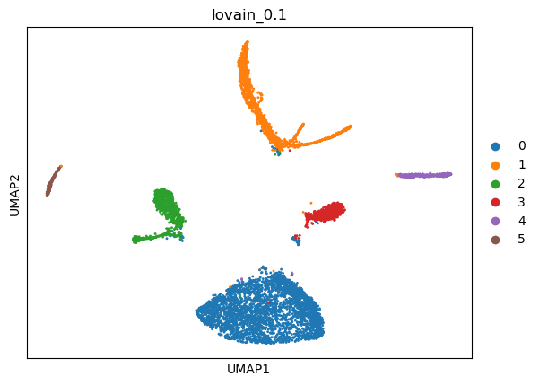
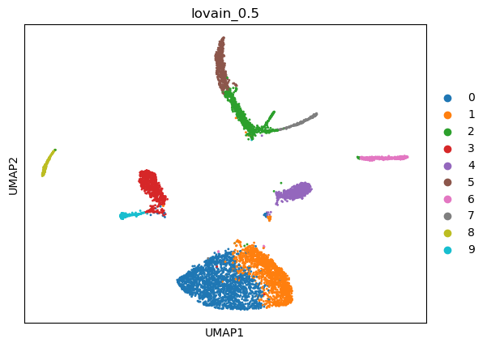
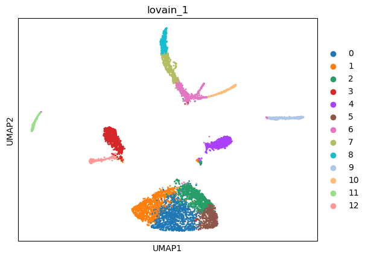

|   kmeans_13 | mr_two_column     |
|------------:|:------------------|
|           0 | Fibroblasts       |
|           1 | Enterocytes       |
|          10 | Endothelial cells |
|          11 | T memory cells    |
|          12 | Enterocytes       |
|           2 | Fibroblasts       |
|           3 | Enterocytes       |
|           4 | T cells           |
|           5 | Goblet cells      |
|           6 | Enterocytes       |
|           7 | Macrophages       |
|           8 | Interneurons      |
|           9 | Plasma cells      |
---

|   kmeans_16 | mr_two_column     |
|------------:|:------------------|
|           0 | Enterocytes       |
|           1 | Enterocytes       |
|          10 | Enterocytes       |
|          11 | T memory cells    |
|          12 | Endothelial cells |
|          13 | Plasma cells      |
|          14 | Endothelial cells |
|          15 | Interneurons      |
|           2 | Enterocytes       |
|           3 | Fibroblasts       |
|           4 | T memory cells    |
|           5 | T memory cells    |
|           6 | Interneurons      |
|           7 | Goblet cells      |
|           8 | Fibroblasts       |
|           9 | Macrophages       |
---

|   leiden_0.1 | mr_two_column   |
|-------------:|:----------------|
|            0 | Enterocytes     |
|            1 | Fibroblasts     |
|            2 | Goblet cells    |
|            3 | T memory cells  |
|            4 | Macrophages     |
|            5 | Plasma cells    |
---

|   leiden_0.25 | mr_two_column     |
|--------------:|:------------------|
|             0 | Enterocytes       |
|             1 | Enterocytes       |
|             2 | Endothelial cells |
|             3 | Goblet cells      |
|             4 | Fibroblasts       |
|             5 | T memory cells    |
|             6 | Macrophages       |
|             7 | Plasma cells      |
---

|   leiden_0.5 | mr_two_column     |
|-------------:|:------------------|
|            0 | Enterocytes       |
|            1 | Enterocytes       |
|            2 | Fibroblasts       |
|            3 | Goblet cells      |
|            4 | Enterocytes       |
|            5 | T memory cells    |
|            6 | Fibroblasts       |
|            7 | Macrophages       |
|            8 | Plasma cells      |
|            9 | Endothelial cells |
|           10 | Paneth cells      |
---

|   leiden_1 | mr_two_column     |
|-----------:|:------------------|
|          0 | Enterocytes       |
|          1 | Enterocytes       |
|          2 | Fibroblasts       |
|          3 | Enterocytes       |
|          4 | Goblet cells      |
|          5 | T memory cells    |
|          6 | Enterocytes       |
|          7 | Fibroblasts       |
|          8 | Macrophages       |
|          9 | Endothelial cells |
|         10 | Plasma cells      |
|         11 | Alpha cells       |
|         12 | Endothelial cells |
|         13 | T memory cells    |
---

|   lovain_0.1 | mr_two_column   |
|-------------:|:----------------|
|            0 | Enterocytes     |
|            1 | Fibroblasts     |
|            2 | Goblet cells    |
|            3 | T memory cells  |
|            4 | Macrophages     |
|            5 | Plasma cells    |
---

|   lovain_0.25 | mr_two_column     |
|--------------:|:------------------|
|             0 | Enterocytes       |
|             1 | Fibroblasts       |
|             2 | Goblet cells      |
|             3 | T memory cells    |
|             4 | Macrophages       |
|             5 | Plasma cells      |
|             6 | Endothelial cells |
---

|   lovain_0.5 | mr_two_column     |
|-------------:|:------------------|
|            0 | Enterocytes       |
|            1 | Enterocytes       |
|            2 | Fibroblasts       |
|            3 | Goblet cells      |
|            4 | T memory cells    |
|            5 | Fibroblasts       |
|            6 | Macrophages       |
|            7 | Endothelial cells |
|            8 | Plasma cells      |
|            9 | Paneth cells      |
---

|   lovain_1 | mr_two_column     |
|-----------:|:------------------|
|          0 | Enterocytes       |
|          1 | Enterocytes       |
|          2 | Enterocytes       |
|          3 | Goblet cells      |
|          4 | T memory cells    |
|          5 | Enterocytes       |
|          6 | Endothelial cells |
|          7 | Fibroblasts       |
|          8 | Fibroblasts       |
|          9 | Macrophages       |
|         10 | Endothelial cells |
|         11 | Plasma cells      |
|         12 | Alpha cells       |
---
