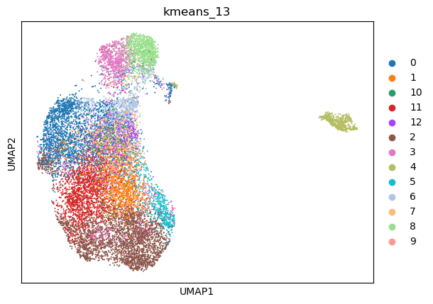
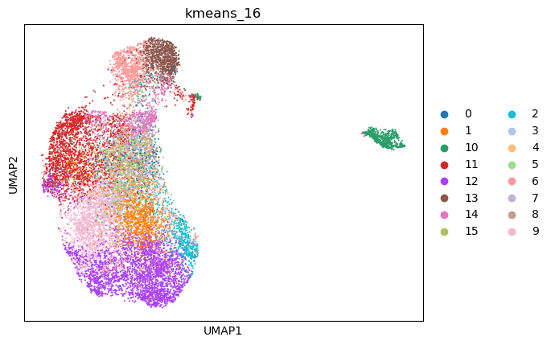
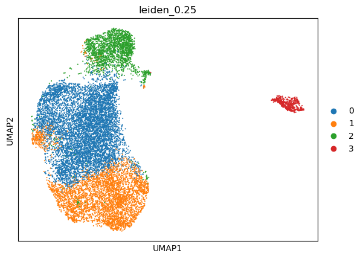
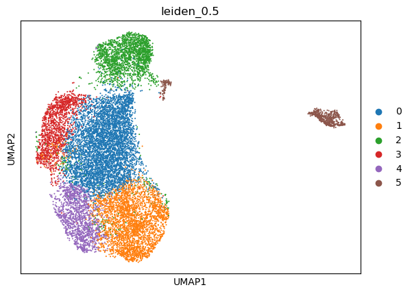
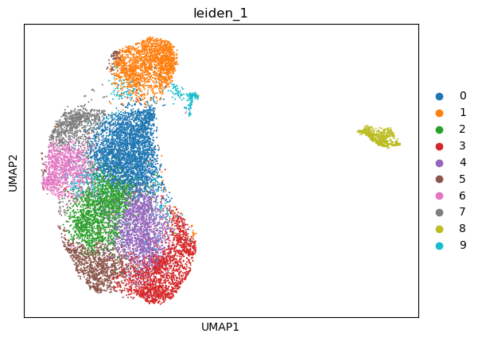
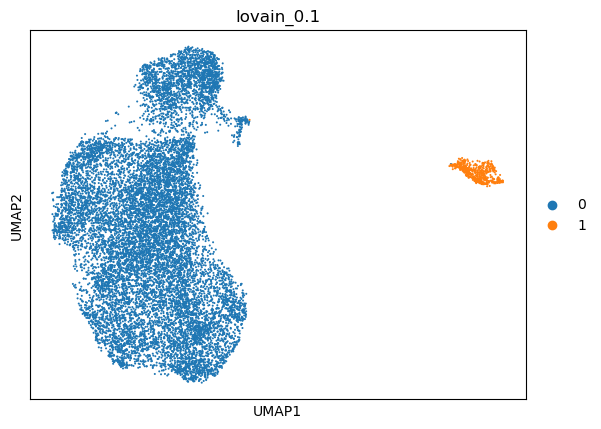
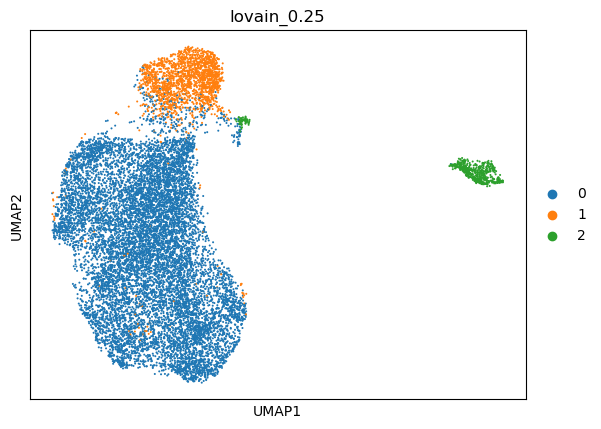
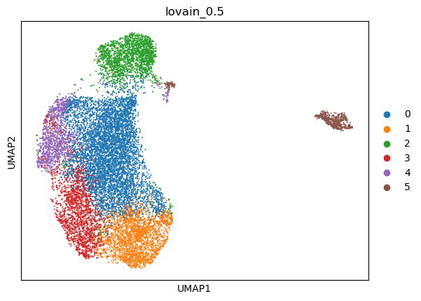
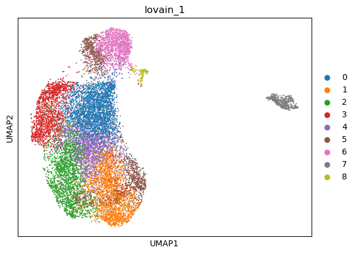

|   kmeans_13 | mr_two_column   |
|------------:|:----------------|
|           0 | Interneurons    |
|           1 | T memory cells  |
|          10 | B cells         |
|          11 | T memory cells  |
|          12 | B cells memory  |
|           2 | Interneurons    |
|           3 | Neurons         |
|           4 | Fibroblasts     |
|           5 | Neurons         |
|           6 | Enterocytes     |
|           7 | Hepatocytes     |
|           8 | T memory cells  |
|           9 | T cells         |
---

|   kmeans_16 | mr_two_column     |
|------------:|:------------------|
|           0 | Beta cells        |
|           1 | T cells           |
|          10 | Fibroblasts       |
|          11 | Interneurons      |
|          12 | Interneurons      |
|          13 | T memory cells    |
|          14 | Enterocytes       |
|          15 | T cytotoxic cells |
|           2 | Neurons           |
|           3 | Oligodendrocytes  |
|           4 | Adipocytes        |
|           5 | T cells           |
|           6 | T memory cells    |
|           7 | T memory cells    |
|           8 | Enteric neurons   |
|           9 | T memory cells    |
---

|   leiden_0.1 | mr_two_column   |
|-------------:|:----------------|
|            0 | T memory cells  |
|            1 | Fibroblasts     |
---

|   leiden_0.25 | mr_two_column   |
|--------------:|:----------------|
|             0 | Acinar cells    |
|             1 | Interneurons    |
|             2 | T memory cells  |
|             3 | Fibroblasts     |
---

|   leiden_0.5 | mr_two_column   |
|-------------:|:----------------|
|            0 | Foveolar cells  |
|            1 | Neurons         |
|            2 | T memory cells  |
|            3 | Interneurons    |
|            4 | T memory cells  |
|            5 | Fibroblasts     |
---

|   leiden_1 | mr_two_column     |
|-----------:|:------------------|
|          0 | Foveolar cells    |
|          1 | T memory cells    |
|          2 | Thymocytes        |
|          3 | Neurons           |
|          4 | T cells           |
|          5 | T cells           |
|          6 | Interneurons      |
|          7 | Endothelial cells |
|          8 | Fibroblasts       |
|          9 | Fibroblasts       |
---

|   lovain_0.1 | mr_two_column   |
|-------------:|:----------------|
|            0 | T memory cells  |
|            1 | Fibroblasts     |
---

|   lovain_0.25 | mr_two_column   |
|--------------:|:----------------|
|             0 | Interneurons    |
|             1 | T memory cells  |
|             2 | Fibroblasts     |
---

|   lovain_0.5 | mr_two_column   |
|-------------:|:----------------|
|            0 | Foveolar cells  |
|            1 | Interneurons    |
|            2 | T memory cells  |
|            3 | T memory cells  |
|            4 | Interneurons    |
|            5 | Fibroblasts     |
---

|   lovain_1 | mr_two_column   |
|-----------:|:----------------|
|          0 | Beta cells      |
|          1 | Interneurons    |
|          2 | T memory cells  |
|          3 | Interneurons    |
|          4 | T cells         |
|          5 | Neurons         |
|          6 | T memory cells  |
|          7 | Fibroblasts     |
|          8 | Fibroblasts     |
---
