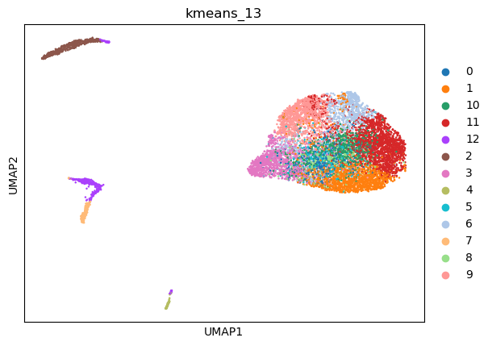
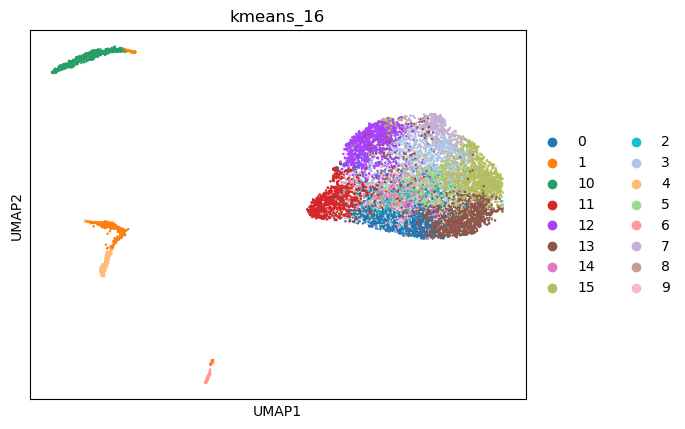
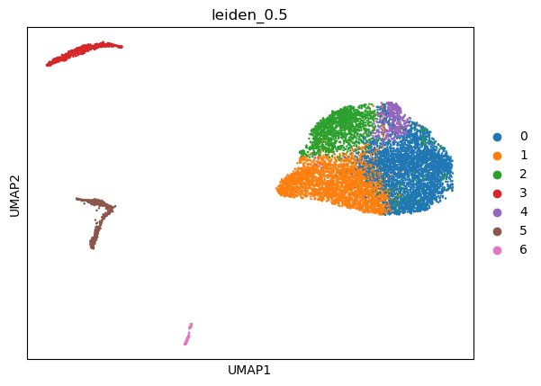
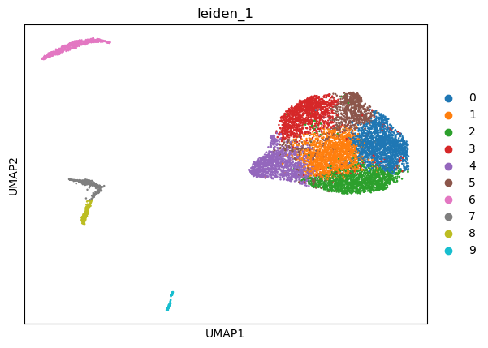
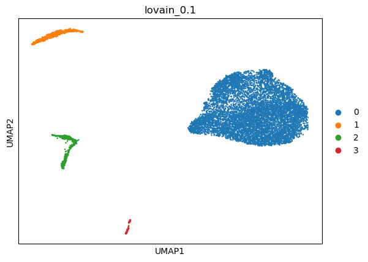
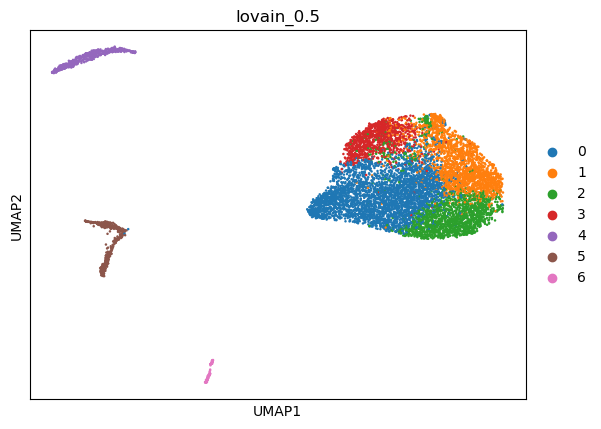
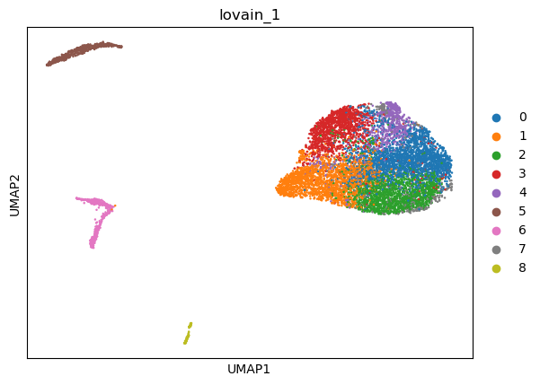

|   kmeans_13 | mr_two_column                   |
|------------:|:--------------------------------|
|           0 | Ductal cells                    |
|           1 | Interneurons                    |
|          10 | Pulmonary alveolar type I cells |
|          11 | Interneurons                    |
|          12 | Endothelial cells               |
|           2 | Fibroblasts                     |
|           3 | Myocytes                        |
|           4 | T memory cells                  |
|           5 | Enterocytes                     |
|           6 | Mammary epithelial cells        |
|           7 | Endothelial cells               |
|           8 | Distal tubule cells             |
|           9 | Fibroblasts                     |
---

|   kmeans_16 | mr_two_column              |
|------------:|:---------------------------|
|           0 | Interneurons               |
|           1 | Endothelial cells          |
|          10 | Fibroblasts                |
|          11 | Cardiomyocytes             |
|          12 | Fibroblasts                |
|          13 | Interneurons               |
|          14 | Transient cells            |
|          15 | Interneurons               |
|           2 | Müller cells               |
|           3 | Olfactory epithelial cells |
|           4 | Endothelial cells          |
|           5 | Podocytes                  |
|           6 | T memory cells             |
|           7 | Mammary epithelial cells   |
|           8 | Loop of Henle cells        |
|           9 | Dopaminergic neurons       |
---

|   leiden_0.1 | mr_two_column     |
|-------------:|:------------------|
|            0 | Follicular cells  |
|            1 | Fibroblasts       |
|            2 | Endothelial cells |
|            3 | T memory cells    |
---

|   leiden_0.25 | mr_two_column     |
|--------------:|:------------------|
|             0 | Follicular cells  |
|             1 | Fibroblasts       |
|             2 | Endothelial cells |
|             3 | T memory cells    |
---

|   leiden_0.5 | mr_two_column     |
|-------------:|:------------------|
|            0 | Interneurons      |
|            1 | B cells naive     |
|            2 | Neurons           |
|            3 | Fibroblasts       |
|            4 | Epithelial cells  |
|            5 | Endothelial cells |
|            6 | T memory cells    |
---

|   leiden_1 | mr_two_column     |
|-----------:|:------------------|
|          0 | Interneurons      |
|          1 | Follicular cells  |
|          2 | Interneurons      |
|          3 | Neurons           |
|          4 | Interneurons      |
|          5 | Ductal cells      |
|          6 | Fibroblasts       |
|          7 | Endothelial cells |
|          8 | Endothelial cells |
|          9 | T memory cells    |
---

|   lovain_0.1 | mr_two_column     |
|-------------:|:------------------|
|            0 | Follicular cells  |
|            1 | Fibroblasts       |
|            2 | Endothelial cells |
|            3 | T memory cells    |
---

|   lovain_0.25 | mr_two_column     |
|--------------:|:------------------|
|             0 | Follicular cells  |
|             1 | Fibroblasts       |
|             2 | Endothelial cells |
|             3 | T memory cells    |
---

|   lovain_0.5 | mr_two_column     |
|-------------:|:------------------|
|            0 | Germ cells        |
|            1 | Principal cells   |
|            2 | Interneurons      |
|            3 | Neurons           |
|            4 | Fibroblasts       |
|            5 | Endothelial cells |
|            6 | T memory cells    |
---

|   lovain_1 | mr_two_column     |
|-----------:|:------------------|
|          0 | Neurons           |
|          1 | Germ cells        |
|          2 | Interneurons      |
|          3 | Fibroblasts       |
|          4 | Epithelial cells  |
|          5 | Fibroblasts       |
|          6 | Endothelial cells |
|          7 | Interneurons      |
|          8 | T memory cells    |
---
