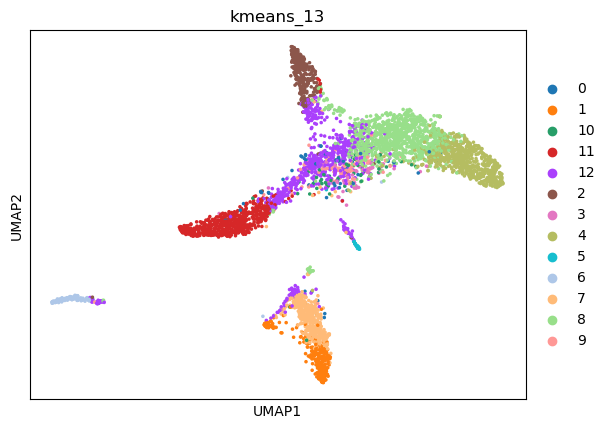

|   kmeans_13 | mr_two_column       |
|------------:|:--------------------|
|           0 | Endothelial cells   |
|           1 | Endothelial cells   |
|          10 | Interneurons        |
|          11 | Smooth muscle cells |
|          12 | Interneurons        |
|           2 | Smooth muscle cells |
|           3 | Trigeminal neurons  |
|           4 | Fibroblasts         |
|           5 | Schwann cells       |
|           6 | Macrophages         |
|           7 | Endothelial cells   |
|           8 | Fibroblasts         |
|           9 | Interneurons        |
---

|   kmeans_16 | mr_two_column             |
|------------:|:--------------------------|
|           0 | Endothelial cells         |
|           1 | Interneurons              |
|          10 | Schwann cells             |
|          11 | Macrophages               |
|          12 | Smooth muscle cells       |
|          13 | Schwann cells             |
|          14 | Smooth muscle cells       |
|          15 | Endothelial cells         |
|           2 | Interneurons              |
|           3 | Stromal cells             |
|           4 | Fibroblasts               |
|           5 | Fibroblasts               |
|           6 | Smooth muscle cells       |
|           7 | Fibroblasts               |
|           8 | Endothelial cells (aorta) |
|           9 | Retinal ganglion cells    |
---

|   leiden_0.1 | mr_two_column       |
|-------------:|:--------------------|
|            0 | Fibroblasts         |
|            1 | Endothelial cells   |
|            2 | Smooth muscle cells |
|            3 | Smooth muscle cells |
|            4 | Macrophages         |
---

|   leiden_0.25 | mr_two_column       |
|--------------:|:--------------------|
|             0 | Fibroblasts         |
|             1 | Endothelial cells   |
|             2 | Smooth muscle cells |
|             3 | Smooth muscle cells |
|             4 | Macrophages         |
|             5 | Schwann cells       |
---

|   leiden_0.5 | mr_two_column       |
|-------------:|:--------------------|
|            0 | Fibroblasts         |
|            1 | Endothelial cells   |
|            2 | Smooth muscle cells |
|            3 | Smooth muscle cells |
|            4 | Fibroblasts         |
|            5 | Macrophages         |
|            6 | Schwann cells       |
---

|   leiden_1 | mr_two_column       |
|-----------:|:--------------------|
|          0 | Fibroblasts         |
|          1 | NK cells            |
|          2 | Fibroblasts         |
|          3 | Smooth muscle cells |
|          4 | Smooth muscle cells |
|          5 | Endothelial cells   |
|          6 | Smooth muscle cells |
|          7 | Endothelial cells   |
|          8 | Macrophages         |
|          9 | Schwann cells       |
|         10 | Endothelial cells   |
---

|   lovain_0.1 | mr_two_column       |
|-------------:|:--------------------|
|            0 | Fibroblasts         |
|            1 | Endothelial cells   |
|            2 | Smooth muscle cells |
|            3 | Macrophages         |
---

|   lovain_0.25 | mr_two_column       |
|--------------:|:--------------------|
|             0 | Fibroblasts         |
|             1 | Endothelial cells   |
|             2 | Smooth muscle cells |
|             3 | Smooth muscle cells |
|             4 | Macrophages         |
|             5 | Schwann cells       |
---

|   lovain_0.5 | mr_two_column       |
|-------------:|:--------------------|
|            0 | Fibroblasts         |
|            1 | Endothelial cells   |
|            2 | Smooth muscle cells |
|            3 | Fibroblasts         |
|            4 | Smooth muscle cells |
|            5 | Macrophages         |
|            6 | Schwann cells       |
---

|   lovain_1 | mr_two_column       |
|-----------:|:--------------------|
|          0 | Fibroblasts         |
|          1 | Fibroblasts         |
|          2 | Endothelial cells   |
|          3 | Smooth muscle cells |
|          4 | Enterocytes         |
|          5 | Smooth muscle cells |
|          6 | Macrophages         |
|          7 | Schwann cells       |
|          8 | Endothelial cells   |
|          9 | Endothelial cells   |
---
